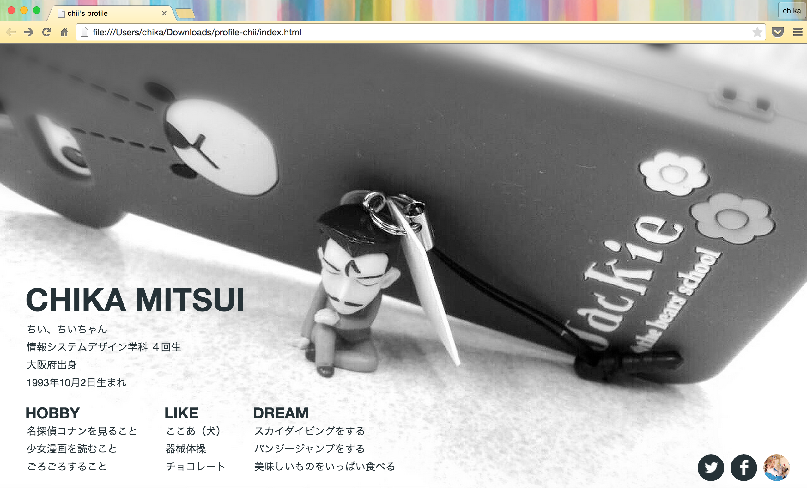
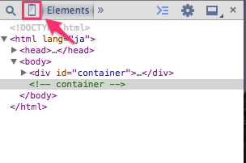
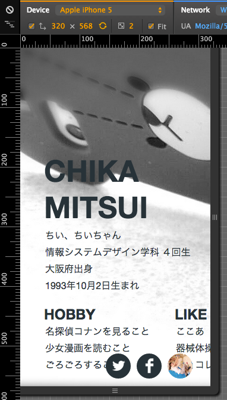
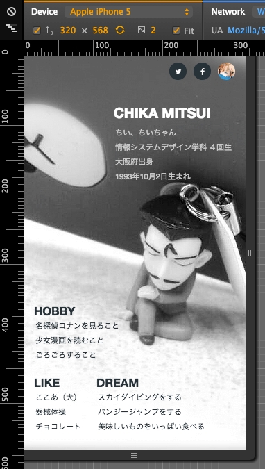

# レスポンシブデザインの作り方

以下のプロフィールページを例に，レスポンシブデザインの作り方について説明します．



プロフィールページの作成が終わったら，デベロッパーツールを開いてみてください．
デベロッパーツールには様々な機能がありますが，その中の一つにモバイル向けのデバッグ機能として搭載された「エミュレーション機能」というものがあります．
スマートフォンやタブレットなど様々なデバイスでの表示の確認ができます．
（デベロッパーツールについての説明は<a href="../common/dev_tool.md" target="_blank">ここ</a>にあります）
デベロッパーツールのスマホのアイコンをクリックしてください．



この機能を使って確認してみると...



上の画像のように，ブラウザで見るとうまく表示されていますが，スマホサイズで見るとレイアウトが崩れてしまっています．
レスポンシブデザインにすることによって，これを直していきましょう．

## レスポンシブデザインとは

デバイスサイズによって，自動的にレイアウトが切り替わるデザインのことです．
各デバイスに合わせた適切なレイアウトに変更します．
レスポンシブデザインを作るには，**viewport**と**メディアクエリ**を使います．

### viewportについて

スマートフォン，タブレットで表示する際のサイトの見え方の指定です．
縦幅や横幅，拡大縮小の倍率などの指定が出来ます．
HTMLのにmeta要素として記述します．

**記述例**

`<meta name=viewport content="width=device-width, initial-scale=1, maximum-scale=1">`

ここでの設定は以下の通りです．

* `width=device-widh` : コンテンツの横幅をデバイスの横幅に設定
* `initial-scale=1` : ページを開いた瞬間の倍率を1倍に設定
* `maximum-scale=1` : 最大拡大比率を1に設定

詳しい指定方法は以下の通りです．

| プロパティ     | 値について |
|:-------------|:------------|
|width         | 初期値は980px．viewportの横幅の指定です．指定出来る値は200px〜10000px,device-width．|
|height        | 初期値は「横幅とのアスペスト比から計算される値」．指定できる値は200px〜10000px,device-height．|
|initial-scale |倍率の初期値の設定．デフォルトではページを画面に合わせる．指定可能範囲は次に書く[minimum-scale, maximum-scale]の範囲．|
|minimum-scale | 最小縮小比率の設定．デフォルトは 0.25 で指定可能範囲は0より大きく，10までの値．|
|maximum-scale | 最小拡大比率の設定．デフォルトは 1.6 で指定可能範囲は0より大きく，10までの値．|
|user-scalable | ユーザーがズームできるかどうかの設定．初期値はyes．数字指定も可能．yes=1,no=0．|

### メディアクエリについて

ウインドウサイズやデバイス解像度などの様々な条件に合わせたcssの変更します．

**記述例**

```css
@media screen and (max-width: 1000px) {
  #container{
    width : 95%;
  }
}
@media screen and (max-width: 760px) {...}
@media screen and (max-width: 480px) {...}
@media screen and (max-width: 320px) {...}
```

上記のように```@media screen and (max-width: ○○px) {}```の中に書くと，それぞれのサイズのときだけのスタイルを指定することができます．

## まとめ

レスポンシブデザインを作るには

1. **viewport**
1. **メディアクエリ**

の2つについて覚えましょう！
この2つの変更を加えて，表示を確認すると...



このように表示されました．
自分のプロフィールページをスマホ対応にしてみましょう．


### 参考資料
* [レスポンシブWebデザインはviewportとメディアクエリーからはじめろ！](https://web.archive.org/web/20140725140332/http://barktoimagine.com/web/846)
* [CSS3 Media Queries を使って，Webサイトをスマートフォンに対応させるときの注意書き](http://webdesignrecipes.com/web-design-for-mobile-with-css3-media-queries)
* [レスポンシブWebデザインの作り方（簡単設定方法）](http://webdesignerwork.jp/web/responsivewebdesign/)


