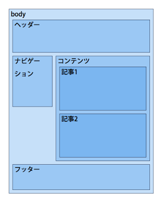
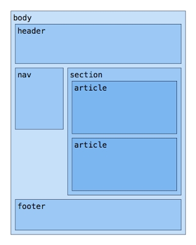
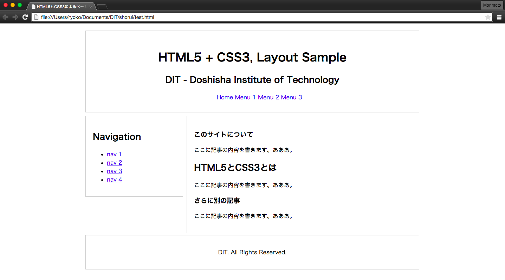

#html5+CSS3のタグを覚えよう

## サイトの構成
最近html5が導入されてから、構成がより分かりやすくなりました。
例えば、ブログのようなヘッダーとフッターを持った２カラムのレイアウトのページを想定してください。
ヘッダーとフッターに挟まれた左側のカラムはナビゲーションのメニューがあり、右側のカラムにはメインとなるコンテンツがあり、その中に複数の記事があるとします。これを図にすると以下のようになります。



この構造をhtml5では以下のようなタグを使って表すことができます。

* header: ページに表示されるヘッダー。headと同じ要素ではないので注意。
* nav: 他のページへのリンクの集まり。
* section: 本の章のような、見出しを持つもの。
* article: ブログやWebマガジン、一覧記事などに掲載されている個々のエントリー。
* footer: ページに表示されるフッター。細かい文字での説明やメッセージの署名など。

これらの要素を利用して先ほどのレイアウトを整理すると以下のようになります。



html5ではこれらの名称を要素名として使用することができます。サイトごとに独自に命名されたクラス名やid名ではなく、こうして標準化された要素名を使うことにより、それぞれのセクションの役割が一目でわかったり、他のメディアや検索エンジンなどからページを参照する際に重要な役割を果たします。

## html5で構造化要素を試してみよう
それでは上の図のようなブログのようなものを作っていきましょう。使用する要素は、header, section, article, nav, footerになります。
headの部分は、必ずこれを書くというおまじないのようなものです。
bodyの部分は、図を参考にどのようにしたらいいか考えてみてください。
見出しを作りたい、リストを作りたい、という場合はリファレンス一覧が<a href="../common/html_reference.md">こちら</a>にあるのでそれを参考にしてください。

### index.html

```
< !DOCTYPE html>
<html lang="ja">
  <head>
    <meta charset="utf-8" />
    <title>HTML5とCSS3によるページサンプル</title>
    <meta http-equiv="Content-Type" content="text/html; charset=UTF-8" />
  </head>
  <body>
    <header>
      <h1>HTML5 + CSS3, Layout Sample</h1>
      <h2>DIT - Doshisha Institute of Technology</h2>
      <ul>
        <li><a href="#">Home</a></li>
        <li><a href="#">Menu 1</a></li>
        <li><a href="#">Menu 2</a></li>
        <li><a href="#">Menu 3</a></li>
      </ul>
    </header>
    <section>
      <article>
        <h1>このサイトについて</h1>
        <p>ここに記事の内容を書きます。あああ。</p>
        <h2>HTML5とCSS3とは</h2>
        <p>ここに記事の内容を書きます。あああ。</p>
      </article>
      <article>
        <h1>さらに別の記事</h1>
        <p>ここに記事の内容を書きます。あああ。</p>
      </article>
    </section>
    <nav>
      <h1>Navigation</h1>
      <ul>
        <li><a href="#">nav 1 </a></li>
        <li><a href="#">nav 2 </a></li>
        <li><a href="#">nav 3 </a></li>
        <li><a href="#">nav 4 </a></li>
      </ul>
    </nav>
    <footer>
      <p>DIT. All Rights Reserved.</a></p>
    </footer>
  </body>
</html>
```

ではこれをブラウザで確認してみましょう。想定したブログのような形にはなっていませんよね。第一回の勉強会でもやったように、htmlは文章の区分構造を示しているだけで、そのレイアウトの具体的な方法を指示しているわけではありません。この区分構造をどのようにレイアウトするかは、このhtmlにスタイルシートを適用してレイアウトの方法や視覚的な効果を指定していきます。


## CSS3を使用してレイアウトをしよう

まず、head要素ないに外部スタイルシートへのリンクを指定します。style.cssというファイルにスタイルを書いていきます。
ここの手順は<a href="../1/helloworld.md">第一回の勉強会</a>でやった内容を思い出してください。

### style.css

```
body {
    width:960px;
    margin:20px auto;
}
header, nav, section, footer {
    display:block;
    border:1px solid #ccc;
    margin:5px;
    padding:20px;
}
header {
    text-align:center;
    padding:30px;
}
header ul, header li {
    list-style-type:none;
    display:inline;
}
nav {
    float:right;
    width:236px; 
}
section {
    float:right;
    width:620px;
}
footer {
    clear:both !important;
    text-align: center;
}
```
ここまでやって、もう一度ブラウザで確認してみましょう。そうすると、よく見るブログのような形になっていると思います。




