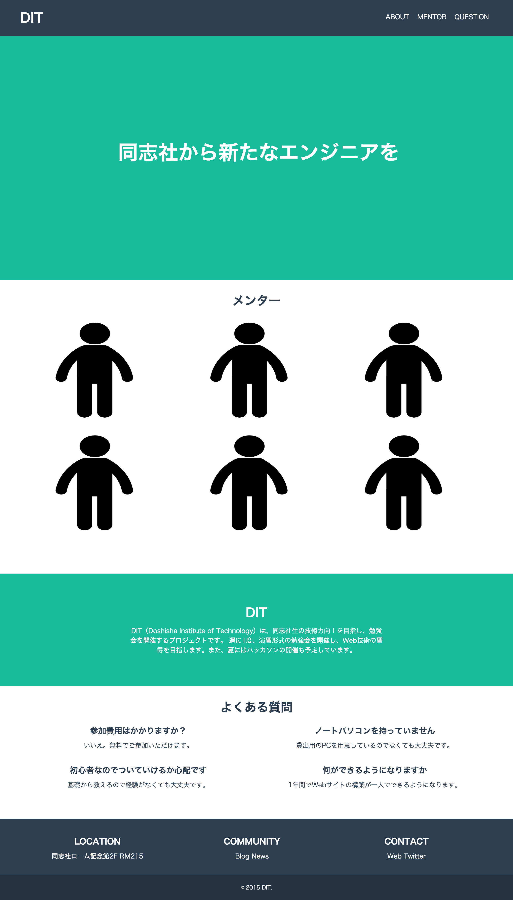
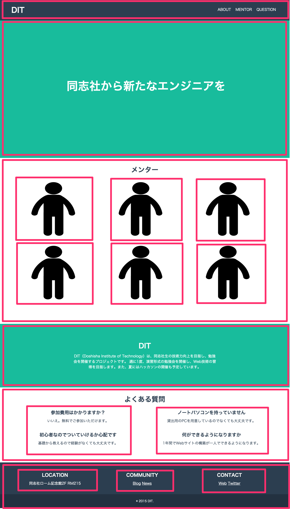
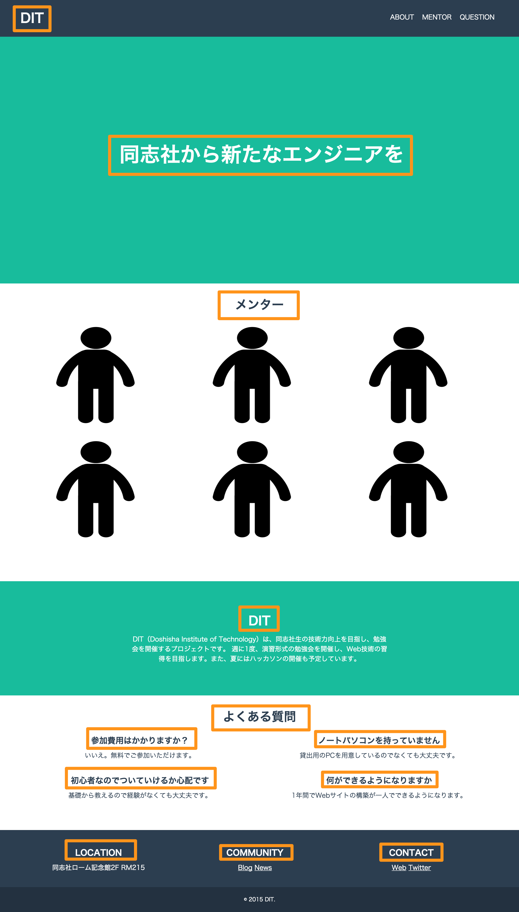

# HTMLとCSSでDITのようなWebサイトを作ってみよう

## 課題

今回は、これまでに勉強したHTML、CSSの知識を使ってDITのようなWebサイトを作成してみましょう。

HTMLの構造のヒントを下に書いています。まずは自分で考えてみて、わからなかったらヒントを見てください。

## ヒント

HTMLの構造は以下の図のようになっています。

### div
ピンク色の四角で囲まれた部分をdivタグで作ってみましょう。

### h1〜h3 
オレンジ色の四角で囲まれた部分をh1〜h3タグで作ってみましょう。

### p 
青色の四角で囲まれた部分をpタグで作ってみましょう。

### ul, li, a 
黄色の四角で囲まれた部分をリストやaタグで作ってみましょう。

### 要素を横並びにするには
前回の授業で、`float`というものが出てきました。
`float`を使えばできるかも...

<a href="../3/basic_bloglike_layout.md" target="_blank">前回のテキスト</a>を確認してみましょう。

