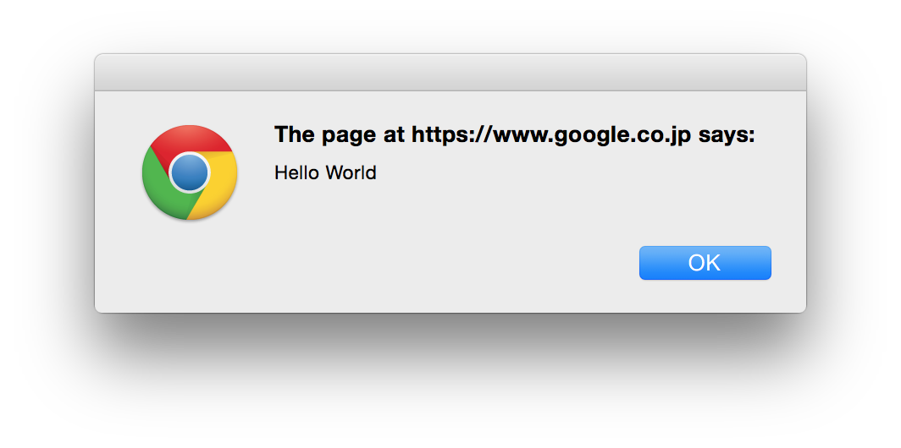

# JavaScript 入門

## JavaScriptとは
ブラウザ（Internet Explorer, Firefox, Google Chromeなど）で動く、プログラミング言語です。

今まで習ったHTMLとCSSでは、ユーザーからの入力を受け付けたり、*ダイアログボックス*が出るWebサイトは作れませんでした。

例えば、Twitterのツイート画面では、テキストボックスに文章入れ、「ツイート」ボタンを押すことで投稿できますよね。この「ツイート」ボタンが押された際、JavaScriptが動き、テキストボックスに書かれた文章を取得し投稿する、ということをしています。


このように、JavaScriptを使うと、*動きのあるサイトが作れます。*

## 動かしてみる

では、JavaScriptを実際に動かしてみましょう。

1. [テンプレートファイル](./sample/js_template.zip)をダウンロードして解凍
2. `script.js`をSublime Textで開く
3. 以下のプラグラムを打つ
4. `index.html`をブラウザで開いて動作確認

```javascript
alert("Hello World");
```

ブラウザを開くと、以下の様なダイアログボックスが表示されます。



## 関数（メソッド）

`alert()`のような書き方をするものを関数（メソッド）と言います。*複数の処理を一つにまとめる*際に使うと覚えておけば良いでしょう。
`alert`関数は予め定義されている関数です。自分で関数を定義することもでき、以下のように書きます。

```javascript
function foo() {
  // 何らかの処理をここに書く
}
```

関数を実行するには、以下のように書きます。

```javascript
foo();
```

## 変数

変数は、数字や文字列が入れられる箱です。`var`（variableの略）を使って変数を宣言します。
`=`記号がありますが、これは両辺が等しいという意味ではなく、*右辺を左辺に代入する*の意味です。
間違いやすいので気をつけましょう。

```javascript
var a = 100;
var b = "文字もok";
```

上記の例は、aという箱（変数）に100を代入し、bという箱（変数）に`文字もok`という文字列を代入しています。また、変数を定義したあとに値を再代入することもできます。

```javascript
var a = 100;
a = 0;
```

この場合、変数`a`の中身は0になります。

## 変数とalertを使ったプログラム

まずは、適当な変数を定義し、`alert`で変数の中身を表示してみましょう。

```javascript
var suuji = 0;
alert(suuji); // 0が表示される
```

ちゃんと0がダイアログボックスに表示されますね。このように、`alert`に変数の名前を指定すると、*その変数の中身を見ることができます。*

### 四則演算

プログラム中では四則演算が使えるので、計算をした結果を`alert`で表示してみましょう。

```javascript
var suuji = 10;
alert(suuji + 100); // 110が表示される
```

10 + 100 が計算され、`110`がダイアログボックスに表示されますね。足し算と同様に、引き算、掛け算、割り算もできますが、数学と記号が違うので注意してください。

|   /   |  数学  | JavaScript |
|-------|------|------------|
| 足し算 |   +  |      +     |
| 引き算 |   -  |      -     |
| 掛け算 |   ×  |      *     |
| 割り算 |   ÷  |      /     |

### Quiz.1

以下のプログラムを実行した結果、何が表示されるでしょう。考えてみてください（2行目がポイントですね）。解答は一番下にあります。

```javascript
var suuji = 10;
suuji = suuji + 100;

alert(suuji);
```

## htmlと組み合わせる

次は、htmlでアクション（ボタンが押される等）が起こった際に`alert`を表示してみます。

まずボタンを表示しましょう。`index.html`に以下の様な`input`タグを追記してみましょう。

#### index.html
```html
<body>
  <input type="button" value="送信">
</body>
```

送信と書かれた小さなボタンができます。


まだ押しても何も起きないので、押した時の動作をつけていきます。

### ボタンに動作を付ける

まず、今作った`input`タグに適当なid名を振りましょう。

#### index.html

```html
<input id="alert-button" type="button" value="送信">
```

次にボタンが押された時の動作をJavaScriptで書きます。

#### script.js

```javascript
var alertButton = document.getElementById("alert-button");

alertButton.addEventListener("click", function() {
  alert("ボタンが押されました");
});
```

このプログラムを実行すると、ボタンが押された時に`ボタンが押されました`とダイアログで表示されるはずなのですが...。
プログラム自体はあってますが、実はまだ動作しません。

理由は、簡単に言うと、先ほど作ったid="alert-button"がついたボタンが読み込まれる前にJavaScriptが実行されているためです。
これを解決するためには、すべてのプログラムを`window.onload`で囲む必要があります。

```javascript
window.onload = function() {
  var alertButton = document.getElementById("alert-button");

  alertButton.addEventListener("click", function() {
    alert("ボタンが押されました");
  });
};
```

これでボタンを押すとアラートが表示されました。

### ボタンに動作を付ける（解説）

急に難しくなりましたが、めげずに頑張りましょう。まず、新しく出てきたメソッドの説明をします。

#### document.getElementById("id名")

これは、指定したid名のタグの情報を取得するメソッドです。

```javascript
var alertButton = document.getElementById("alert-button");
```

1行目のプログラムを日本語にすると、「alert-buttonというid名が付いたElement(タグ)の情報を、alertButtonという変数に代入してね」という感じです。

#### element.addEventListener()

`addEventListener`というメソッドを使うことで、そのタグにイベントを指定することができます。第一引数がイベントの種類（今回の場合`click`）、第二引数がそのイベントが発生した際に実行する関数です。（引数については[ここ](http://www.ajaxtower.jp/js/function/index3.html)を参照してください）

```javascript
alertButton.addEventListener("click", function() {
  alert("ボタンが押されました");
});
```

日本語にすると、「alertButtonに`click`イベントを設定します。このボタンがクリックされた時には、`alert`を実行してください」という感じです。

#### window.onload = function() {};

HTMLがすべてロードされた後にfunctionの中身が実行されます。
HTMLが読み込まれていない状態で`document.getElementById`等が実行されてしまうと、
JavaScriptはタグを見つけることができないので動作しません。

## 応用

さて、ここまでJavaScriptでよく使う、変数や関数、クリックイベント等をみてきました。ここでは、それらを応用して動きのある例をみていきます。

### カウンターを作る

ボタンを押すと、数字がカウントアップされていくカウンターを作ってみましょう。

まず、ボタンと数字が入る箱を用意します。

```html
<p id="counter">0</p>
<input id="countup-button" type="button" value="カウントアップ">
```

このボタンが押された際、数字を0から順番に+1していくようなプログラムをJavaScriptで書きます。

#### script.js
```javascript
window.onload = function() {
  var count = 0;
  var countButton = document.getElementById("countup-button");

  countButton.addEventListener('click', function() {
    count++; // count = count + 1 と同義
    document.getElementById("counter").innerHTML = count;
  });
};
```

`count`という変数を定義して、クリックされた時に+1しています。その後、`counter`の要素を取得して、タグの中身を`count`の値に書き換えています。`innerHTML`を使うと、タグの中身を書き換えたり、取得できたりします。

## クイズの解答
### Quiz.1

```javascript
var suuji = 10;
suuji = suuji + 100;

alert(suuji);
```

A. 110

`suuji = suuji + 100`を実行すると、まず右辺が計算されます。右辺の`suuji`は、上で定義されている通り10になります。右辺の`suuji`が10なので`10 + 100`となって110と計算されます。この110が左辺の`suuji`へ再代入され、結果として110が`alert`で表示されます。
