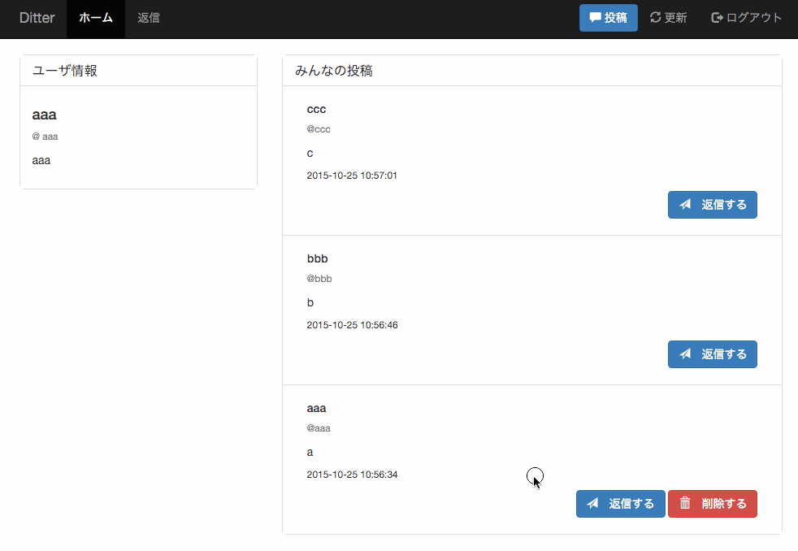

# 投稿削除機能の実装
本稿では投稿（つぶやき）削除機能を実装する．

## 要求仕様


 * `index.php?delete_post_id=つぶやきのID` を呼び出すとつぶやきが削除される．
   * ただし，サインインしていない状態で呼び出すと `signin.php` にリダイレクトされる．
 * 返信ボタンの右側に削除ボタンを表示する．
   * ただし，現在サインインしているユーザが投稿したつぶやきに限り削除ボタンを表示する．

## 実装手順
1. `functions.php` に投稿を削除する関数を実装する（PHP, SQL）
2. `index.php` に削除ボタンを実装する（HTML, PHP）
3. `index.php` に投稿削除機能を実装する（PHP）

## 今回使う構文や関数

### SQL: ``DELETE FROM posts WHERE id = ?;``

DELETE 構文は条件に当てはまる行をテーブルから削除する．  
本稿では投稿を削除するために使用している．

例えば， ``DELETE FROM posts WHERE id = 1;`` は posts テーブルから id カラムが1の行を削除する．

```sql
mysql> SELECT * FROM posts;
+----+---------+---------------------+------+---------------------+---------------------+
| id | user_id | in_reply_to_user_id | text | created_at          | updated_at          |
+----+---------+---------------------+------+---------------------+---------------------+
|  1 |       1 |                NULL | a    | 2015-10-01 00:00:00 | 2015-10-01 00:00:00 |
|  2 |       2 |                NULL | b    | 2015-10-01 00:00:00 | 2015-10-01 00:00:00 |
|  3 |       3 |                NULL | c    | 2015-10-01 00:00:00 | 2015-10-01 00:00:00 |
+----+---------+---------------------+------+---------------------+---------------------+
3 rows in set (0.00 sec)

mysql> DELETE FROM posts WHERE id = 1;
Query OK, 1 row affected (0.00 sec)

mysql> SELECT * FROM posts;
+----+---------+---------------------+------+---------------------+---------------------+
| id | user_id | in_reply_to_user_id | text | created_at          | updated_at          |
+----+---------+---------------------+------+---------------------+---------------------+
|  2 |       2 |                NULL | b    | 2015-10-01 00:00:00 | 2015-10-01 00:00:00 |
|  3 |       3 |                NULL | c    | 2015-10-01 00:00:00 | 2015-10-01 00:00:00 |
+----+---------+---------------------+------+---------------------+---------------------+
2 rows in set (0.00 sec)
```

なお， WHERE 句が SQL 文に含まれない場合は全ての行が削除される．

```sql
mysql> DELETE FROM posts;
Query OK, 2 rows affected (0.00 sec)

mysql> SELECT * FROM posts;
Empty set (0.00 sec)
```

### PHP: ``<?php if true: ?>always true...lol<?php endif; ?>``

PHP の制御構文は，同じ機能を持ちながら異なる書き方が用意されている場合がある．  
本稿で使用する if 構文もまた，異なる書き方が用意されている．  
なお，以下の出力は全て同一である．

#### pattern 1

```php
<?php if (true): ?>
always true...lol
<?php endif; ?>
```

#### pattern 2

```php
<?php
if (true):
  print 'always true...lol';
endif;
?>
```

#### pattern 3

```php
<?php
if (true)
  print 'always true...lol';
?>
```

#### output

```
always true...lol
```

### PHP: ``$_SERVER['SCRIPT_NAME']``

``$_SERVER`` には HTTP ヘッダの情報や PHP スクリプトのファイル名が格納される．  
例えば， ``$_SERVER['SCRIPT_NAME']`` には実行されたスクリプトのパスが格納される．  
以下の例では var_dump 関数を使用して ``$_SERVER`` に格納される情報を表示した．

#### test.php

```
<?php
  var_dump($_SERVER);
?>
```

#### output

以下の出力は ``var_dump($_SERVER);`` の抜粋である．  
全ての出力を確認する場合は test.php を作成してブラウザから [http://localhost/test.php](http://localhost/test.php) にアクセスすること．

```
array(33) {
  ["UNIQUE_ID"]=>
  string(24) "hoge"
  ["HTTP_HOST"]=>
  string(12) "hoge.local"
  ["HTTP_CONNECTION"]=>
  string(10) "keep-alive"
  ["HTTP_CACHE_CONTROL"]=>
  string(9) "max-age=0"
  ["HTTP_ACCEPT"]=>
  string(74) "text/html,application/xhtml+xml,application/xml;q=0.9,image/webp,*/*;q=0.8"
  ["HTTP_UPGRADE_INSECURE_REQUESTS"]=>
  string(1) "1"
  ["HTTP_USER_AGENT"]=>
  string(120) "Mozilla/5.0 (Macintosh; Intel Mac OS X 10_10_5) AppleWebKit/537.36 (KHTML, like Gecko) Chrome/46.0.2490.80 Safari/537.36"
  ["HTTP_ACCEPT_ENCODING"]=>
  string(19) "gzip, deflate, sdch"
  ["DOCUMENT_ROOT"]=>
  string(35) "/Users/hoge/Documents/DIT/ditter/"
  ["REQUEST_SCHEME"]=>
  string(4) "http"
  ["CONTEXT_DOCUMENT_ROOT"]=>
  string(35) "/Users/hoge/Documents/DIT/ditter/"
  ["SCRIPT_FILENAME"]=>
  string(43) "/Users/hoge/Documents/DIT/ditter/test.php"
  ["SERVER_PROTOCOL"]=>
  string(8) "HTTP/1.1"
  ["REQUEST_METHOD"]=>
  string(3) "GET"
  ["REQUEST_URI"]=>
  string(9) "/test.php"
  ["SCRIPT_NAME"]=>
  string(9) "/test.php"
  ["PHP_SELF"]=>
  string(9) "/test.php"
}
```

## 1. `functions.php` に投稿を削除する関数を実装する（PHP, SQL）

`functions.php` に投稿を削除する関数を実装する．

deletePost 関数はパラメータにPDOインスタンスと投稿のidをとる．  
返り値は無い．

### functions.php

```php
function getTimeline($pdo, $start, $postsNum)
{
    $sql = 'SELECT * FROM posts ORDER BY `created_at` DESC LIMIT :start, :postsNum';
    $statement = $pdo->prepare($sql);
    $statement->bindValue(':start', $start, PDO::PARAM_INT);
    $statement->bindValue(':postsNum', $postsNum, PDO::PARAM_INT);
    $statement->execute();
    if ($rows = $statement->fetchAll(PDO::FETCH_ASSOC)) {
        return $rows;
    } else {
        return false;
    }
}

// ここから
function deletePost($pdo, $id)
{
    $sql = 'DELETE FROM posts WHERE id = :id';
    $statement = $pdo->prepare($sql);
    $statement->bindValue(':id', $id, PDO::PARAM_INT);
    $statement->execute();
}
// ここまで
```

## 2. `index.php` に削除ボタンを実装する（HTML, PHP）

`index.php` に削除ボタンを実装する．

サインインしているユーザのID $user_id と，投稿したユーザのID $post_by['id'] が一致する場合に削除ボタンを表示する．  
リンク先は `index.php?delete_post_id=つぶやきのID` である．  

? 以降の部分をクエリ文字列（ URL パラメータ）と呼ぶ．
クエリ文字列は， Web ブラウザなどの HTTP クライアントからサーバにパラメータを渡す際に使用される．  
書式は以下の通りである．

 * path?param1=value1
 * path?param1=value1&param2=value2
 * path?param1=value1&param2=value2&param3=value3&...

### index.php

```php
<p class="text-right">
    <button type="button" class="btn btn-primary reply-btn" data-toggle="modal" data-target="#replyModal">
        <span class="glyphicon glyphicon-send" aria-hidden="true"></span>　返信する
    </button>
    <!-- ここから -->
    <?php if ($user_id == $post_by['id']): ?>
        <a class="btn btn-danger reply-btn" href="<?php print 'index.php?delete_post_id='.$value['id'] ?>">
            <span class="glyphicon glyphicon-trash" aria-hidden="true"></span>　削除する
        </a>
    <?php endif; ?>
    <!-- ここまで -->
</p>
```

## 3. `index.php` に投稿削除機能を実装する（PHP）

`index.php` に投稿削除機能を実装する．

リクエストにクエリ文字列が含まれる場合は PHP によってパースされ`$_GET`に格納される．  
以下の実装では， delete_post_id が含まれる場合は deletePost 関数を呼び出し， `$_SERVER['SCRIPT_NAME']` つまり `index.php` にリダイレクトする．

### index.php

```php
if ($_SERVER['REQUEST_METHOD'] === 'POST') {
  if (isset($_POST['postText'])){
    $postText = $_POST['postText'];
    writePost($db, $user_id, $postText);
    header('Location: index.php');
    exit;
  }
}

// ここから
if (isset($_GET['delete_post_id'])) {
    $delete_post_id = $_GET['delete_post_id'];
    deletePost($db, $delete_post_id);
    header('Location: '.$_SERVER['SCRIPT_NAME']);
    exit;
}
// ここまで
```

## 応用課題


本稿の実装では，サインインした状態で delete_post_id のパラメータを書き換えて呼び出すと，別のユーザが投稿したつぶやきも削除することが出来る．  
つぶやきを投稿したユーザでなければ削除出来ないようにプログラムを改良すること．  
改良の際の手がかりを以下に記す．

 * $user_id は，現在サインインしているユーザのIDである．
 * posts テーブルの user_id カラムは，つぶやきを投稿したユーザの ID である．

## 参考資料
 * [MySQL :: MySQL 5.6 リファレンスマニュアル :: 13.2.2 DELETE 構文](https://dev.mysql.com/doc/refman/5.6/ja/delete.html)
 * [CSS · Bootstrap](http://getbootstrap.com/css/)
 * [PHP: PDO - Manual ](https://secure.php.net/manual/ja/book.pdo.php)
 * [PHP: $_GET - Manual ](https://secure.php.net/manual/ja/reserved.variables.get.php)
 * [PHP: $_SERVER - Manual ](https://secure.php.net/manual/ja/reserved.variables.server.php)
 * [PHP: var_dump - Manual ](https://secure.php.net/manual/ja/function.var-dump.php)
