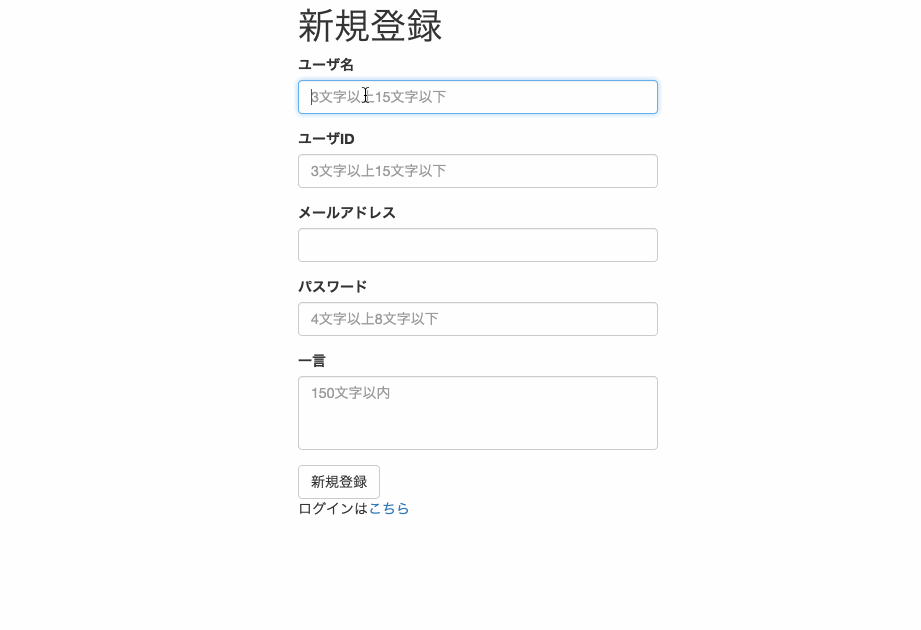

# 新規登録のエラーチェック

本稿では、新規登録の機能にエラーチェックを追加します。新規登録のフォームには、プレースホルダーで"3文字以上15文字以下"のように書かれていますが、実際にそのチェックをしていませんでした。要求されている条件に合わないの文字数などで新規登録をしてみてください。エラーなく登録が出来てしまいますね。これを直していきましょう。

## 完成図



ほとんど見た目は変わりません。条件に合わない場合は登録が失敗するようにし、それぞれのエラーの内容を表示するようにします。

## 実装手順

1. エラーチェックの追加（PHP）
1. エラーを表示させる（HTML, PHP）

## 1. エラーチェックの追加（PHP）

ユーザが入力した情報をDBに登録する前に、条件に合っているかチェックするためのif文を追加します。**もし文字数が〇〇以上だったら登録OK、以下だったらエラー**という風に書いていきます。`signup.php`を書き換えましょう。大きく書き換えがあるので、気をつけて下さい。また、新たな関数を`functions.php`に追加します。

### コード

#### signup.php

```php

<?php
require_once 'init.php';

// 以下を追記
// 変数の初期化
$error = [];
$user_name = '';
$screen_name = '';
$email = '';
$password = '';
$comment = '';

if ($_SERVER['REQUEST_METHOD'] === 'POST') {
  
  // ここにあったif文を削除

  $user_name = $_POST['user_name'];
  $screen_name = $_POST['screen_name'];
  $email = $_POST['email'];
  $password = $_POST['password'];
  $comment = $_POST['comment'];

  $db = connectDb();

  // 以下を追記

  // ユーザ名の文字数チェック
  if (mb_strlen($user_name) < 3 || mb_strlen($user_name) > 15) {
    $error['user_name'] = '3文字以上15文字以下にしてください';
  }
  // スクリーン名が英数字であることかつ文字数チェック
  if (!preg_match('/^[a-zA-Z0-9]{3,15}$/', $screen_name)) {
    $error['screen_name'] = '3文字以上15文字以下の英数字にしてください';
  // スクリーン名が既に登録されているかどうかチェック
  } elseif (getUserIdByScreenName($db, $screen_name)) {
    $error['screen_name'] = 'このidは既に登録されています';
  }
  // メールアドレスが入力されているかどうかチェック 
  if ($email === '') {
    $error['email'] = 'メールアドレスを入力してください';
  // メールアドレスの形式が正しいかどうかチェック 
  } elseif (!filter_var($email, FILTER_VALIDATE_EMAIL)) {
    $error['email'] = 'メールアドレスの形式が正しくないです';
  // メールアドレスが既に登録されているかどうかチェック
  } elseif (emailExists($email, $db)) {
    $error['email'] = 'このメールアドレスは既に登録されています';
  }
  // パスワードが英数字であることかつ文字数チェック
  if (!preg_match('/^[a-zA-Z0-9]{4,8}$/', $password)) {
    $error['password'] = '4文字以上8文字以下の英数字にしてください';
  }
  // コメントの文字数チェック
  if (mb_strlen($comment) > 150) {
    $error['comment'] = '150文字以下にしてください';
  // エラーがなければデータベースに挿入する
  } 
  if (empty($error)) {
  
    // 以下はそのまま 
    
    $hash = password_hash($password, PASSWORD_DEFAULT);
    $sql = 'INSERT INTO users (screen_name, user_name, email, password, comment) VALUES (:screen_name, :user_name, :email, :password, :comment)';
    $statement = $db->prepare($sql);

    $statement->bindValue(':screen_name', $screen_name, PDO::PARAM_STR);
    $statement->bindValue(':user_name', $user_name, PDO::PARAM_STR);
    $statement->bindValue(':email', $email, PDO::PARAM_STR);
    $statement->bindValue(':password', $hash, PDO::PARAM_STR);
    $statement->bindValue(':comment', $comment, PDO::PARAM_STR);

    if($statement->execute()) {
      $signin_url = "signin.php";
      header("Location: {$signin_url}");
      exit;
    } else {
      print "データベースへの挿入に失敗しました";
    }
  }
}

?>
```

#### functions.php

```php
function emailExists($email, PDO $pdo)
{
  $sql = 'SELECT * FROM users WHERE email = :email';
  $statement = $pdo->prepare($sql);
  $statement->bindValue(':email', $email, PDO::PARAM_STR);
  $statement->execute();
  $row = $statement->fetch();
  return $row ? true : false;
}
```

### コードの解説

追加した条件を見ていきましょう。エラーがなければDBに保存、エラーがあれば`$error`という配列にエラーの内容を代入しておきます。

#### ユーザ名のエラーチェック

以下の1点をチェックします。

* 文字数が3文字以上15文字以下であること

```php
// ユーザ名の文字数チェック
if (mb_strlen($user_name) < 3 || mb_strlen($user_name) > 15) {
  $error['user_name'] = '3文字以上15文字以下にしてください';
}
```

[mb_strlen](http://php.net/manual/ja/function.mb-strlen.php)は、マルチバイト文字の1文字を1として、文字列の長さを得るための関数です。マルチバイト文字とは、2バイト以上のデータで表現される文字のことで、ひらがなや漢字などの全角文字は多バイト文字となるので、この関数はひらがなや漢字1文字を1として数えます。ここでは、`$user_name`の長さを取得し、3文字より小さく、15文字より大きければエラーとなり、**3文字以上15文字以下にしてください**という文を`$error['user_name']`に保存します。

#### スクリーン名のエラーチェック

以下の2点をチェックします。

* 3文字以上15文字以下の英数字にしてください

```php
// スクリーン名が英数字であることかつ文字数チェック
if (!preg_match('/^[a-zA-Z0-9]{3,15}$/', $screen_name)) {
  $error['screen_name'] = '3文字以上15文字以下の英数字にしてください';
}
```

[preg_match](http://php.net/manual/ja/function.preg-match.php)を使って正規表現のマッチングを行います。正規表現の`/^[a-zA-Z0-9]{3,15}$/`は、3文字以上15文字以下の英数字を示します。よって、`$screen_name`が3文字以上15文字以下の英数字ではなければエラーとなり、`$error['screen_name']`に**3文字以上15文字以下の英数字にしてください**という文を`$error['screen_name']`に保存します。

* 既に登録していないこと

```php
// スクリーン名が既に登録されているかどうかチェック
elseif (getUserIdByScreenName($db, $screen_name)) {
  $error['screen_name'] = 'このidは既に登録されています';
}
```

スクリーン名は重複してはいけないので既に登録されているものは登録できません。なので、既に登録されているかチェックします。`getUserIdByScreenName`という`$screen_name`からユーザIDを取得するための関数が既にありました。functions.phpを確認してみましょう。スクリーン名があれば`true`になり、その場合登録はできません。エラーとなり、`$error['screen_name']`を上書きします。

#### メールアドレスのエラーチェック

以下の3点をチェックします。

* 入力されていること 

```php
// メールアドレスが入力されているかどうかチェック 
if ($email === '') {
  $error['email'] = 'メールアドレスを入力してください';
}
```

`$email === ''`で、`$email`が空文字だったらエラーです。

* メールアドレスの形式が正しいこと 

```php
// メールアドレスの形式が正しいかどうかチェック 
elseif (!filter_var($email, FILTER_VALIDATE_EMAIL)) {
  $error['email'] = 'メールアドレスの形式が正しくないです';
}
```

[filter_var](http://php.net/manual/ja/function.filter-var.php)は指定したフィルタでデータをフィルタリングする関数です。ここでは、`$email`がメールアドレスの形式として正しいかのチェックをしています。

* 既に登録されていないこと 

```php
// メールアドレスが既に登録されているかどうかチェック
elseif (emailExists($email, $db)) {
  $error['email'] = 'このメールアドレスは既に登録されています';
}
```

メールアドレスは重複してはいけないので既に登録されているものは登録できません。なので、既に登録されているかチェックします。`emailExists`という関数を`functions.php`に書きます。

```php
function emailExists($email, PDO $pdo)
{
    $sql = 'SELECT * FROM users WHERE email = :email';
    $statement = $pdo->prepare($sql);
    $statement->bindValue(':email', $email, PDO::PARAM_STR);
    $statement->execute();
    $row = $statement->fetch();
    return $row ? true : false;
}
```

この関数は、メールアドレスが一致するユーザがいれば`true`、なければ`false`を返します。`true`が返ってくれば、既にそのメールアドレスを使用しているユーザがいるということなのでエラーになります。

#### パスワードのエラーチェック

以下の1点をチェックします。

* 4文字以上8文字以下の英数字であること

```php
// パスワードが英数字であることかつ文字数チェック
if (!preg_match('/^[a-zA-Z0-9]{4,8}$/', $password)) {
  $error['password'] = '4文字以上8文字以下の英数字にしてください';
}
```

スクリーン名のエラーチェックで出てきたものと同じです。

#### コメントのエラーチェック

以下の1点をチェックします。

* 文字数が150文字以下であること

```php
// コメントの文字数チェック
if (mb_strlen($comment) > 150) {
  $error['comment'] = '150文字以下にしてください';
}
```

ユーザ名のエラーチェックで出てきたのと同じです。

#### エラーがなければDBに保存

```php
// エラーがなければデータベースに挿入する
if (empty($error)) {
  ...
}
```

これまでエラーチェックをしてきましたが、もしエラーがあれば`$error`にエラーの内容を保存するようにしていました。なので、エラーがなかった場合は`$error`に何も入らないので空のままですね。`empty($error)`で、エラーが空だったらという条件になります。やっとDBに保存されます。

## 2. エラーを表示させる（HTML, PHP）

エラー文は`$error`に入っています。これを、エラーがあった時に表示させるようにしましょう。`signup.php`のHTML内の`<form>`の中の`<input>`と`<textarea>`のすぐ下に1行追加します。

### コード

#### signup.php

```php
<form action="<?php print $_SERVER['SCRIPT_NAME']; ?>" method="POST">
  <div class="form-group">
    <label for="userName">ユーザ名</label>
    <input type="text" class="form-control" id="userName" name="user_name" placeholder="3文字以上15文字以下" value="<?php print escape($user_name); ?>">
    <!-- 1行を追加 -->
    <p><?php if (array_key_exists('user_name', $error)) { print escape($error['user_name']); } ?></p>
    <!-- 追加ここまで -->
  </div>
  <div class="form-group">
    <label for="screenName">ユーザID</label>
    <input type="text" class="form-control" id="screenName" name="screen_name" value="<?php print escape($screen_name); ?>" placeholder="3文字以上15文字以下">
    <!-- 1行を追加 -->
    <p><?php if (array_key_exists('screen_name', $error)) { print escape($error['screen_name']); } ?></p>
    <!-- 追加ここまで -->
  </div>
  <div class="form-group">
    <label for="email">メールアドレス</label>
    <input type="email" class="form-control" id="email" name="email" value="<?php print escape($email); ?>"> 
    <!-- 1行を追加 -->
    <p><?php if (array_key_exists('email', $error)) { print escape($error['email']); } ?></p>
    <!-- 追加ここまで -->
  </div>
  <div class="form-group">
    <label for="password">パスワード</label>
    <input type="password" class="form-control" id="password" name="password" placeholder="4文字以上8文字以下">
    <!-- 1行を追加 -->
    <p><?php if (array_key_exists('password', $error)) { print escape($error['password']); } ?></p>
    <!-- 追加ここまで -->
  </div>
  <div class="form-group">
    <label for="comment">一言</label>
    <textarea class="form-control" id="comment" name="comment" placeholder="150文字以内" rows="3" style="resize:none"><?php print escape($comment); ?></textarea>
    <!-- 1行を追加 -->
    <p><?php if (array_key_exists('comment', $error)) { print escape($error['comment']); } ?></p>
    <!-- 追加ここまで -->
  </div>
  <input type="hidden" name="token" value="<?php print escape($_SESSION['token']); ?>">
  <button type="submit" class="btn btn-default">新規登録</button>
</form>
```

### コードの解説

```html
<p><?php if (array_key_exists('user_name', $error)) { print escape($error['user_name']); } ?></p>
```

`array_key_exists`は指定したキーが配列にあるかどうかを調べる関数です。例えば、上記のように`array_key_exists('user_name', $error)`とすると、`$error['user_name']`が存在するかどうかを調べることができます。エラーがあれば存在することになるので、エラー文を`print`で表示させます。

***

以上でエラーチェックは終わりです。実際に間違った値を入力してちゃんとエラーが表示されるか試してみてください。

## 参考 

* [mb_strlen](http://php.net/manual/ja/function.mb-strlen.php)
* [filter_var](http://php.net/manual/ja/function.filter-var.php)
* [preg_match](http://php.net/manual/ja/function.preg-match.php)
* [array_key_exists](http://php.net/manual/ja/function.array-key-exists.php)
