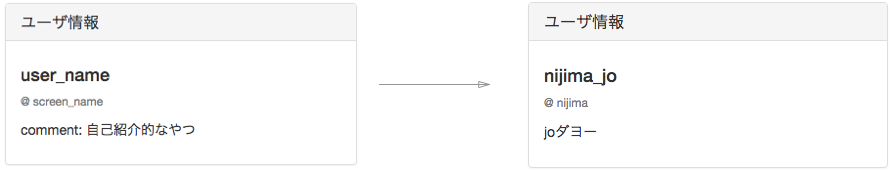

# user情報の表示

今まではユーザー情報を仮置きを表示していましたが、
今回はこれを現在ログインしているユーザーごとに変えるような処理をしていきましょう！

### 完成図



### 要求仕様

現在、ログインしているユーザーの情報を表示する。

### 作成手順

 1. function.phpにgetUserData関数を確認する。
 2. index.phpでユーザーの情報を表示する。

## 1. function.phpにgetUserData関数が存在するか確認しましょう

#### function.php

```php
...
...
function getUserData(PDO $pdo, $id)
{
	$sql = 'SELECT * FROM users WHERE id=:id';
	$statement = $pdo->prepare($sql);
	$statement->bindValue(':id', $id, PDO::PARAM_INT);
	$statement->execute();

	if ($row = $statement->fetch()) {
		return $row;
	} else {
		throw new Exception('ユーザデータを取得できません');
	}
}
...
...
```

なければ、追加しておきましましょう。

### コードの解説

以前にした、
[投稿一覧の表示の作成](https://github.com/dit-rohm/textbook/blob/master/autumn/timeline/timeline.md)
で記述したgetUserData関数です。  

```php
$sql = 'SELECT * FROM users WHERE id=:id';
$statement = $pdo->prepare($sql);
$statement->bindValue(':id', $id, PDO::PARAM_INT);
$statement->execute();
```

の部分でデータベースからデータを取得しています。

 > http://qiita.com/tabo_purify/items/2575a58c54e43cd59630  
こちらのサイトである程度わかりやすく記述されていますので、見てみてください。

## 2. index.phpでユーザーの情報を表示する

では、index.phpでユーザー情報を表示してみましょう。

#### index.php

```php
<?php
...
...

$user_data = getUserData($db, $user_id);
$screen_name = $user_data["screen_name"];
$user_name = $user_data["user_name"];
$comment = $user_data["comment"];

...
...
?>

...
...
<!-- ユーザ情報表示領域 -->
<div class="col-sm-4 col-sm-pull-8">
	<div class="panel panel-default">
		<div class="panel-heading">
			<h3 class="panel-title">ユーザ情報</h3>
		</div>
		<div class="panel-body">
			<h4 class="leader">
			<?php print $user_name ?>
			</h4>
			<p class="small text-muted">@
				<?php print $screen_name ?>
			</p>
			<p>
				<?php print $comment ?>
			</p>
		</div>
	</div>
</div>
...
...

```
ユーザー情報の表示部分はすでにあるはずなので、
それを編集してください。

### コードの解説

解説していきましょう。

```php
<?php
...
...
$user_data = getUserData($db, $user_id);
$screen_name = $user_data["screen_name"];
$user_name = $user_data["user_name"];
$comment = $user_data["comment"];
...
...
?>
```

まず、HTML部分で使いやすい様に`getUserData`で得たuser情報をそれぞれ変数に代入しておきます。
データベースの情報は連想配列で取得しているので、`$user_data[取得したい要素]`で取得できますね。

```php
...
...
<!-- ユーザ情報表示領域 -->
<div class="col-sm-4 col-sm-pull-8">
	<div class="panel panel-default">
		<div class="panel-heading">
			<h3 class="panel-title">ユーザ情報</h3>
		</div>
		<div class="panel-body">
			<h4 class="leader">
			<?php print $user_name ?>
			</h4>
			<p class="small text-muted">@
				<?php print $screen_name ?>
			</p>
			<p>
				<?php print $comment ?>
			</p>
		</div>
	</div>
</div>
...
...
```

先ほどphp上で変数に代入したので、
HTML部分でその変数を扱うには、
phpのコードを埋め込む必要がありますね。  
`<?php  ?>`でphpのコードを埋め込みます。
今回は`print`を用いました。
if文などを用いてもし変数が代入されてなければ、
仮置きを表示するようになどしても良いでしょう。

お疲れ様です。

## 参考
- [PHPでPDOを使ってMySQLに接続、INSERT、UPDATE、DELETE、COUNT、SUM](http://qiita.com/tabo_purify/items/2575a58c54e43cd59630)
- [MySQLリファレンス](https://github.com/dit-rohm/textbook/blob/master/common/mysql.md)
