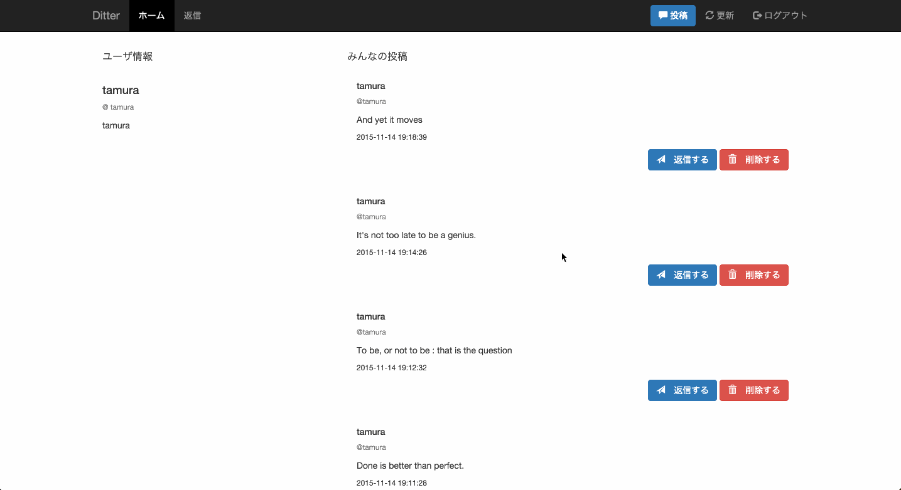

# ページング機能の作成

前章までで投稿の作成・表示が可能となりましたが、投稿が増えてくると1ページに大量の投稿が表示されることになり、見づらかったりページの表示が遅くなったりします。

これを解決するため、1ページに表示される投稿数を5件に制限し、ページを移動することで投稿を辿れるようにします。

ページ制御・移動の機能をここでは「ページング」と呼びます。

## 要求仕様



- 1ページには5件の投稿が表示される
- 1ページ目には最新の投稿が表示される
- リンクをクリックすることで1ページずつ移動が可能
- 1からnまでのページがあり
 - 1ページ目には古い投稿へのリンクがある
 - 2ページ目からn-1ページ目には新しい投稿と古い投稿ヘのリンクがある
 - nページ目には新しい投稿へのリンクがある

## 実装手順

1. GETリクエストでページ番号を受け取る（PHP）
1. そのページで何件目から何件目までの投稿を表示するか計算（PHP）
1. 投稿を表示（PHP, SQL）
1. ページャの実装（PHP）

## 1. GETリクエストでページ番号を受け取る

まずはGETリクエストでページ番号が送られてくることを想定し、それを保持する変数を用意します。

### ページ番号を取得するコード

- index.php

```php
...
...

$user_id = $_SESSION['user_id'];

// ここから追記
$current_page = empty($_GET['page']) ? 1 : $_GET['page'];
$next_page = $current_page + 1;
$prev_page = $current_page - 1;
// 追記ここまで

...
...
```

### コードの解説

- `$current_page`

変数`$current_page`には現在のページを代入します。三項演算子を使って処理しています。

今回のコードであれば **`$_GET['page']`が空ならば`$current_page`に1を代入、それ以外は`$_GET['page']`を代入** となっています。

- `$next_page`, `$prev_page`

現在のページから計算します。

## 2. そのページで何件目から何件目までの投稿を表示するか計算

### 計算のコード

- index.php

```php
...
...

$current_page = empty($_GET['page']) ? 1 : $_GET['page'];
$next_page = $current_page + 1;
$prev_page = $current_page - 1;

// ここから追記
$start_at = ($current_page - 1) * 5;
$show_limit_per_page = 5;
// 追記ここまで

...
...
```

### コードの解説

- 投稿の何件目から表示するか計算

```php
$start_at = ($current_page - 1) * 5;
$show_limit_per_page = 5;
```

表示する投稿数は各ページ5件ですから、0ページなら0から4件目、1ページなら5から9件目となります。

## 3. 投稿を取得

- index.php

```php
...
...

$current_page = empty($_GET['page']) ? 1 : $_GET['page'];
$next_page = $current_page + 1;
$prev_page = $current_page - 1;

$start_at = ($current_page - 1) * 5;
$show_limit_per_page = 5;

// 以下を追記
$posts = getTimeline($db, $start_at, $show_limit_per_page);
...
...
```

- functions.php

`getTimeline()`は既に書いていますが、以下のように書き換えを行います。

```php
function getTimeline($pdo, $start, $postsNum)
{
    $sql = 'SELECT * FROM posts ORDER BY `created_at` DESC LIMIT :start, :postsNum';
    $statement = $pdo->prepare($sql);
    $statement->bindValue(':start', $start, PDO::PARAM_INT);
    $statement->bindValue(':postsNum', $postsNum, PDO::PARAM_INT);
    $statement->execute();
    if ($rows = $statement->fetchAll(PDO::FETCH_ASSOC)) {
        return $rows;
    } else {
        return false;
    }
}
```

### コードの解説

以前は`$posts`に全ての投稿情報を入れていましたが、今回は入れる投稿数を制限します。

`LIMIT`句でデータベースの何件目から何件目のレコードを取得するか制限できます。

その他は以前の`getTimeline()`と変わりません。

## 4. ページャの実装

ページャとはページの移動を行うための要素です。

よく矢印のボタンだったり、ページ番号のリンクが利用されますが、今回は矢印を採用します。

### ページングのコード

- index.php (PHP部分)

```php
...
...

$posts = getTimeline($db, $start_at, $show_limit_per_page);

// 以下を追記
$record_num = postsCounter($db);
$page_limit = $record_num == 0 ? 1 : ceil($record_num / $show_limit_per_page);

...
...
```

- index.php (HTML部分)

HTMLは既に書いてあると思いますので、PHPの部分を加えてください。

```html
<div class="container-fluid text-center">
    <nav>
        <ul class="pager">
        <?php if ($current_page > 1): ?>
            <li class="previous">
                <a href="<?php print '?page='.$prev_page ?>">
                    <span aria-hidden="true">&larr;</span> Newer
                </a>
            </li>
        <?php endif; ?>
        <?php if ($current_page < $page_limit): ?>
            <li class="next">
                <a href="<?php print '?page='.$next_page ?>"> Older
                    <span aria-hidden="true">&rarr;</span>
                </a>
            </li>
        <?php endif; ?>
        </ul>
    </nav>
</div>
```

- functions.php

```php
...
...

function postsCounter($pdo)
{
    $sql = 'SELECT COUNT(*) FROM posts';
    $statement = $pdo->prepare($sql);
    $statement->execute();
    if ($row = $statement->fetch(PDO::FETCH_NUM)) {
        return $row[0];
    } else {
        return 0;
    }
}
```

### コードの解説

- `postsCounter()`

`SELECT`構文と`COUNT`関数を用いて投稿の総数を数える関数です。取得した数は変数`$record_num`に代入します。

- 最大ページ数の計算

```php
$page_limit = $record_num == 0 ? 1 : ceil($record_num / $show_limit_per_page);
```

データベースにレコードが1件も無い場合は最大ページ数を1に、その他の場合はレコードの件数を1ページあたりに表示する件数である5(`$show_limit_per_page`)で割った数を切り上げしています。

例：  
レコードが10件ある → 10 / 5 = 2 → 2ページ  
レコードが11件ある → 11 / 5 = 2.2 → 3ページ

- ページャ本体

`$current_page`が2以上なら前のページヘのリンクを表示、`$page_limit`より小さければ次のページへのリンクを表示しています。

新しい方を"prev"にするか、古い方を"prev"にするかは難しいところですが、今回は新しい方を"prev"としました。

リンクは最初に宣言した`$prev_page`、`$next_page`を利用して以下のように生成しています。

```html
<a href="<?php print '?page='.$prev_page ?>">
<a href="<?php print '?page='.$next_page ?>">
```

以上でページング機能は実装し終えました。ページング機能が有効かどうかは実際にページャをクリックして確かめてください。

## 今回使う構文や関数

### 三項演算子

三項演算子は以下の様な処理を行います。

```php
条件式 ? 式が真の場合 : 式が偽の場合の処理;
```

具体的には以下のように使用します。

```php
$taion >= 37.5 ? print "OUT" : print "SAFE";
```

変数`$taion`が`37.5`以上ならアウト、それ未満ならセーフといった具合です。

### `ceil`関数

端数の切り上げを行います。

```php
print ceil(4.3);    // 5を出力
print ceil(9.999);  // 10を出力
print ceil(-3.14);  // -3を出力
```

### `LIMIT`句

読み込む件数を制限します。

```sql
SELECT カラム名 FROM テーブル名 LIMIT [開始位置,] 読み込む件数;
```

何件目のレコードから取得するかを指定する「開始位置」は必要であれば記述します。記述が無ければ先頭から開始されます。

### `COUNT`関数

`SELECT`構文によって得られる行の数を数えます。例えば、

```sql
SELECT COUNT(*) FROM テーブル名
```

とすれば、指定したテーブルの全レコード数が得られます。

## 参考

- [PHP: 比較演算子 - Manual](http://php.net/manual/ja/language.operators.comparison.php#language.operators.comparison.ternary)
- [PHP: ceil - Manual](http://php.net/manual/ja/function.ceil.php)
- [MySQL :: MySQL 5.6 リファレンスマニュアル :: 13.2.9 SELECT 構文](https://dev.mysql.com/doc/refman/5.6/ja/select.html)
- [MySQL :: MySQL 5.6 リファレンスマニュアル :: 12.19.1 GROUP BY (集約) 関数](https://dev.mysql.com/doc/refman/5.6/ja/group-by-functions.html#function_count)
