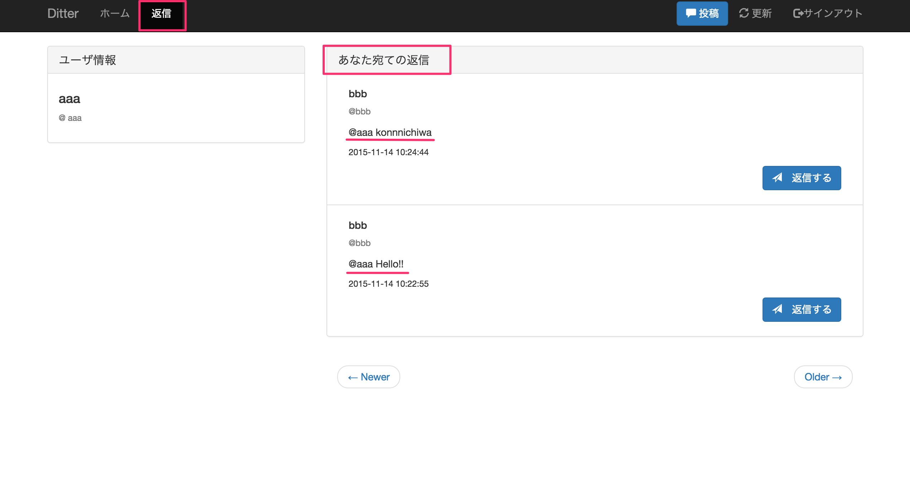

# 返信画面の作成

本稿では、返信画面を作成します。返信画面とは、自分宛の返信の投稿だけをタイムラインに表示させる画面です。

### 完成図


### 要求仕様

**`reply.php`で自分宛ての返信のみのタイムラインを表示させる**

現時点では、投稿には返信先の情報がないので、その投稿がただの投稿か、誰かへの返信のための投稿かどうかの判断が出来ない状態です。そこで、返信の投稿であれば、スクリーン名が投稿の内容に含まれることを利用して、その投稿に返信先の情報（ユーザID）を追加できるようにします。

仕組みは以下の通りです。

1. 投稿の内容に`@スクリーン名`が含まれる場合には返信だとみなす
1. スクリーン名からその返信先ユーザのIDを取得して投稿に情報として持たせる
1. 投稿が持っている返信先のユーザIDが自分のものだけを返信画面のタイムラインに表示させる

### 作成手順
1. 投稿が誰かへの返信だった時、返信先のユーザIDを取得する関数を追加
1. 返信先のユーザIDを保存する関数を追加
1. 自分宛ての返信を取得する関数を追加
1. タイムラインに表示させる

## 1. 投稿が誰かへの返信だった時、返信先のユーザIDを取得する関数を追加

投稿の内容に`@スクリーン名`が含まれるかどうかを調べ、含まれていた場合はその投稿は返信であるとする。

### コード
`functions.php`に追記しましょう。

#### functions.php

```php
// @スクリーン名が含まれていた場合にそのユーザIDを取得する関数
function getReplyId(PDO $pdo, $text)
{
	$at = preg_match('/@(?P<screen_name>[a-zA-Z0-9]+) /', $text, $mention);
	if ($at) {
 		// スクリーン名からユーザIDをを返す
    	return getUserIdByScreenName($pdo, $mention["screen_name"][0]);
    }
    // 返信でなければNULLを返す
    return null;
}

// スクリーン名からユーザIDを取得する関数
function getUserIdByScreenName(PDO $pdo, $screenName)
{
    $sql = 'SELECT id FROM users WHERE `screen_name` = :screen_name';
    $statement = $pdo->prepare($sql);
    $statement->bindValue(':screen_name', $screenName, PDO::PARAM_STR);
    $statement->execute();
    if ($row = $statement->fetch(PDO::FETCH_ASSOC)) {
        return $row['id'];
    } else {
        return null;
    }
}
```

### コードの解説


### コード
`functions.php`の`writePost()`を変更しましょう。

#### functions.php

```php
function writePost(PDO $pdo, $id, $text)
{
	// 以下を変更
    $replyUserId = getReplyId($pdo, $text);
    $sql = 'INSERT INTO posts (user_id,in_reply_to_user_id,text) VALUES (:user_id, :reply_user_id, :text)';
    $statement = $pdo->prepare($sql);
    $statement->bindValue(':user_id', $id, PDO::PARAM_INT);
    $statement->bindValue(':reply_user_id', $replyUserId, PDO::PARAM_INT);
    $statement->bindValue(':text', $text, PDO::PARAM_STR);
    $statement->execute();
}
```

### コードの解説

```
$replyUserId = getReplyId($pdo, $text);
```

この行で、1で作った`getReplyId()`を呼び出しています。この関数は`@スクリーン名`が含まれていた場合にそのユーザIDを取得するための関数でしたね。よって`$replyUserId`には、返信先のユーザIDが入ります。また、もし投稿が返信ではなくただの投稿だった場合は`NULL`が入ります。

```php
...
$sql = 'INSERT INTO posts (user_id,in_reply_to_user_id,text) VALUES (:user_id, :reply_user_id, :text)';

...

$statement->bindValue(':reply_user_id', $replyUserId, PDO::PARAM_INT);

...
```

上記のように`in_reply_to_user_id`カラムに返信先のユーザIDが挿入されるように変更されました。

## 3. 自分宛ての返信を取得する関数を追加

### コード
`functions.php`に以下を追記しましょう。

#### functions.php

```php
// 自分宛ての返信だけを取得する
function getReplyTimeline(PDO $pdo, $userId)
{
  $sql = 'SELECT * FROM posts WHERE `in_reply_to_user_id` = :user_id ORDER BY `created_at` DESC';
  $statement = $pdo->prepare($sql);
  $statement->bindValue(':user_id', $userId, PDO::PARAM_INT);
  $statement->execute();

  if ($rows = $statement->fetchAll(PDO::FETCH_ASSOC)) {
    return $rows;
  } else {
    return false;
  }
}
```

### コードの解説

全ての投稿を取得していた`getTimeline()`と比較してみてください。

```php
function getReplyTimeline(PDO $pdo, $userId)
{
  $sql = 'SELECT * FROM posts WHERE `in_reply_to_user_id` = :user_id ORDER BY `created_at` DESC';
  $statement = $pdo->prepare($sql);
  $statement->bindValue(':user_id', $userId, PDO::PARAM_INT);
  $statement->execute();

  if ($rows = $statement->fetchAll(PDO::FETCH_ASSOC)) {
    return $rows;
  } else {
    return false;
  }
}
```

SQL文の中に`WHERE in_reply_to_user_id = :user_id`が追加されています。

このように、`WHERE 条件式`を追加すると、条件式に一致する行を取得することができるようになります。詳しい説明は[MySQLリファレンス](../common/mysql.md#where)を見て下さい。

ここでは、`in_reply_to_user_id`が`uesr_id`のものだけをpostsテーブルから取得するという条件をつけています。もちろんここの`user_id`は自分のユーザIDです。

これで、自分宛ての返信を取得する関数を準備出来ました。あとは、表示させるだけです！


## 4. タイムラインに表示させる
返信画面は`reply.php`です。`index.php`とほぼ同じになるので、`index.php`を`reply.php`にそのままコピペして下さい。その後、少しだけ編集していきます。

### コード
`reply.php`の以下の3点を書き換えましょう。

#### reply.php
```php
<?php
// PHP部分
...

$user_id = $_SESSION['user_id'];
$db = connectDb();

// 以下を変更1
$posts = getReplyTimeline($db, $user_id);
// 変更1ここまで

...

<!-- ここからHTML部分 -->

...
<ul class="nav navbar-nav">
  <!-- 以下を変更2 -->
  <li><a href="./index.php">ホーム</a></li>
  <li class="active"><a href="./reply.php">返信</a></li>
  <!-- 変更2ここまで -->
</ul>
...

<!-- 全員の投稿表示領域の見出しの部分 -->
<div class="panel-heading">
  <!-- 以下を変更3 -->
  <h3 class="panel-title">あなた宛ての返信</h3>
  <!-- 変更3ここまで -->
</div>
```

### コードの解説

```php
$posts = getReplyTimeline($db, $user_id);
```

`$post`には3で作成した`getReplyTimeline()`の返り値である自分宛ての返信のみが入ります。あとは、[投稿一覧表示の作成](https://github.com/dit-rohm/textbook/blob/master/autumn/timeline/timeline.md)と同じです。

```html
<li><a href="./index.php">ホーム</a></li>
<li class="active"><a href="./reply.php">返信</a></li>
```
Bootstrapで`class="active"`に対してCSSが当てられているので、それを適応させることができます。返信ボタンが押されているようなデザインに変わりましたね。

### 応用課題

本稿の実装では、ページング機能は実装できていません。以前トップページのページング機能は実装しましたね。ほぼ同じなので、[ページング機能の作成](../paging/paging.md)のテキストを見ながら、ページング機能を実装してみましょう！

***

以上で返信画面の作成は終わりです！ここまでで、Ditterの最低限の部分の実装は終わりました！お疲れ様です！！

これから先は、もっと細かい部分へと入ります。

### 今回使った構文や関数
- [preg\_match](http://php.net/manual/ja/function.preg-match.php)

### 参考
- [MySQLリファレンス](../common/mysql.md)
