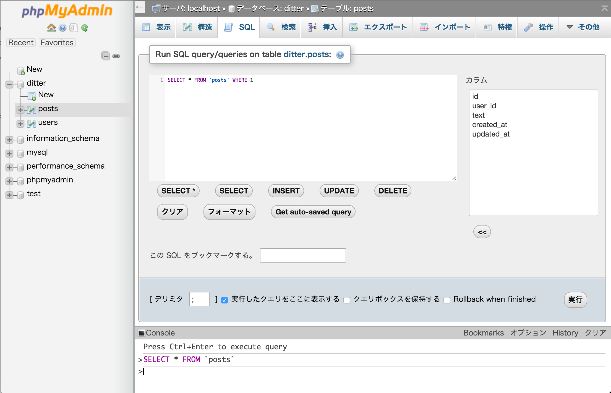
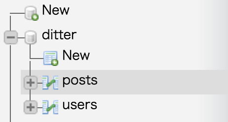
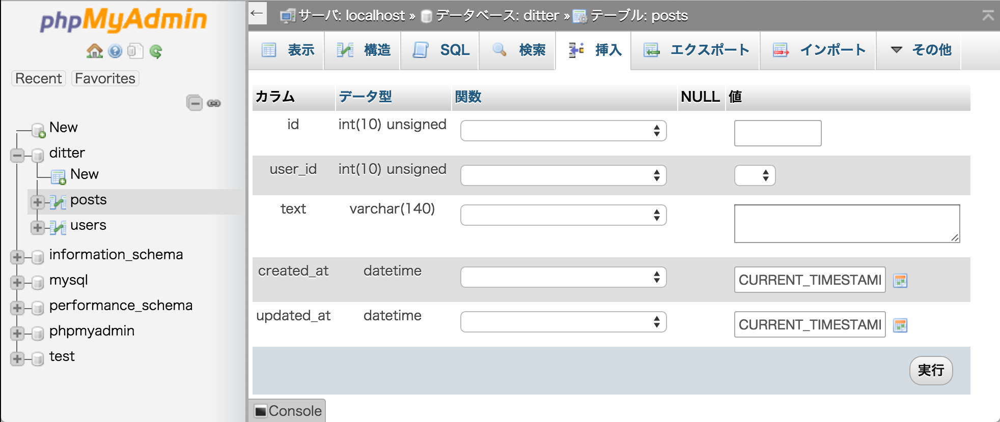

# 投稿一覧の表示

今回は投稿一覧を表示する部分を作ります。

以下の順番で実装していきます。

1. サインイン済みかチェック（PHP）
1. 投稿を保存するテーブルを作成（SQL）
1. ダミーの投稿データを入れてみる（SQL）
1. 投稿を取得（PHP）
1. まだ投稿が無い場合の表示（HTML, PHP）
1. 投稿がある場合の表示（HTML, PHP）

今回、HTML部分にPHPのコードを組み込む箇所が多く、どこを修正するのか分かりづらいかもしれません。

検索を駆使したり、分からなければメンターに質問してください。

## 1. サインイン済みかチェック

サインインしていなければ、タイムラインにアクセスできないようにします。

以前作成した`isSignin()`がここでも使えます。

### サインイン済みかチェックするコード

- index.php

```php
<?php
require_once 'init.php';

// サインイン済みかどうかのチェックを行う
if (!isSignin()) {
    $signin_url = 'signin.php';
    header("Location: {$signin_url}");
    exit;
}
...
...
```

### コードの解説

if文は条件式が`true`だった場合に処理がなされ、また`isSignin()`は`true` or `false`が帰ってきますから、

```php
if (!isSignin())
```

とすることで`false`が返ってきた場合の処理が書けます。

## 2. 投稿を保存するテーブルの作成

ユーザの情報を保存する`users`テーブルを作ったのと同様に、投稿の情報を保存する`posts`テーブルも作成しなければいけません。

アドレスバーに"localhost/phpmyadmin/"と入力して、phpMyAdminを開いてください。

左ペインにあるデータベースの中から「ditter」データベースを選んでください。

右ペインの「表示」、「構造」と並んでいる中から「SQL」を選択してください。



```SQL
SELECT * FROM `posts` WHERE 1
```

と書いてある箇所を下記の「`posts`テーブルを作成するSQL」書き換えて、右下の実行を押してください。

### `posts`テーブルを作成するSQL

```SQL
CREATE TABLE IF NOT EXISTS `posts` (
    `id` INT UNSIGNED NOT NULL AUTO_INCREMENT,
    `user_id` INT UNSIGNED NOT NULL,
    `in_reply_to_user_id` INT UNSIGNED,
    `text` VARCHAR(140) NOT NULL,
    `created_at` DATETIME NOT NULL DEFAULT CURRENT_TIMESTAMP,
    `updated_at` DATETIME NOT NULL DEFAULT CURRENT_TIMESTAMP ON UPDATE CURRENT_TIMESTAMP,
    FOREIGN KEY (user_id)
        REFERENCES users (id)
        ON DELETE CASCADE,
    FOREIGN KEY (in_reply_to_user_id)
        REFERENCES users (id)
        ON DELETE SET NULL,
    PRIMARY KEY (`id`)
);
```

### SQLの解説

`posts`は6つの属性を持っています

- id - 投稿は1つずつ`id`を持っています。割り振る数字は自動で増加させます
- user_id - 投稿者の`id`です。外部キーとして`users`テーブルの`id`への関連付けを行います
- in_reply_to_user_id リプライ時に誰へのリプライなのか、相手の`id`を保持し`users`テーブルの`id`に関連付けます
- text - 投稿の本文です。140字まで入力可能です。
- created_at - 作成日時です
- updated_at - 更新日時です

#### `ON DELETE`句について

```SQL
FOREIGN KEY (user_id)
    REFERENCES users (id)
    ON DELETE CASCADE,
FOREIGN KEY (in_reply_to_user_id)
    REFERENCES users (id)
    ON DELETE SET NULL
```

`ON DELETE`句のあとに`CASCADE`と指定すると、親テーブルで削除操作があった場合、同じ値を持つ子テーブルの属性が削除されます。

また、`ON DELETE`句の後に`SET NULL`と指定すると、親テーブルで削除操作があった場合、同じ値を持つ子テーブルの属性が`NULL`になります。

例えば親テーブルでユーザAの削除が行われると、

- `posts`テーブルの`user_id`がユーザAの`id`と一致すると、そのレコードを削除
- `posts`テーブルの`in_reply_to_user_id`がユーザAの`id`と一致すると、`in_reply_to_user_id`を`NULL`に変更

します。

## 3. ダミーの投稿データを入れてみる

### GUIを利用する方法

**腕試しに自分でSQLを打ち込んでみたい方は、次の「CUIっぽく挿入する方法」へ飛んでください**

phpMyAdminを利用してダミーの投稿データを手動で入力し、投稿の表示ができているかを確認しましょう。

アドレスバーに"localhost/phpmyadmin/"と入力して、phpMyAdminを開いてください。

左ペインにあるデータベースの中から「ditter」データベースの「posts」テーブルを選んでください。



右ペインの「表示」、「構造」と並んでいる中から「挿入」を選択してください。

「値」の列のフォームにそれぞれ入力すれば、データベースにレコードを挿入することができます。



入力は以下のようにしてください。

- `id`は空
- `user_id`はこれまでに作成したユーザから1人選ぶ
- `text`は適当な本文
- `created_at`, `updated_at`はそのまま

**「1 行挿入しました。id num の行を挿入しました」** とメッセージが出力されればダミーデータの挿入は成功です。

### CUIっぽく挿入する方法

**GUIを利用する方法でデータを挿入できた方は飛ばしてください**

アドレスバーに"localhost/phpmyadmin/"と入力して、phpMyAdminを開いてください。

あとは「2. 投稿を保存するテーブルの作成」でやった操作と同様です。

```SQL
SELECT * FROM `posts` WHERE 1
```

と書いてある箇所をダミーデータの挿入を行う文に書き換えて、右下の実行を押せばSQLを実行できます。

もっとCUIっぽく操作したい方は、下の方にある「Console」をクリックすると幸せになれます。

入力は以下のようにしてください。

- `id`は空
- `user_id`はこれまでに作成したユーザから1人選ぶ
- `text`は適当な本文
- `created_at`, `updated_at`はそのまま

**「1 行挿入しました。id num の行を挿入しました」** とメッセージが出力されればダミーデータの挿入は成功です。

### `index.php`にて確認

ダミー用データを挿入できたら、`localhost/index.php`にアクセスして投稿が表示されているか確認してみましょう。

表示されていなければ、どこかで誤りが無いかもう一度見直しましょう。

## 4. 投稿を取得

投稿を取得する関数を作ります。`index.php`は一部作成済みですので、PHPの箇所に続きを書いてください。

### 投稿を取得するコード

- index.php

```php
<?php
require_once 'init.php';
...
...
// ここから追加します
$db = connectDb();
$posts = getTimeline($db);
// ここまで
?>
<!DOCTYPE html>
...
...
```

- functions.php

```php
function getTimeline($pdo)
{
    $sql = 'SELECT * FROM posts ORDER BY `created_at` DESC';
    $statement = $pdo->prepare($sql);
    $statement->execute();

    if ($rows = $statement->fetchAll(PDO::FETCH_ASSOC)) {
        return $rows;
    } else {
        return false;
    }
}
```

### コードの解説

`getTimeline()`を作って、`SELECT`構文で得た検索結果を変数`$posts`に代入しています。

以下のコードは、SQLの実行結果を取得するコードですが、`fetchAll()`の引数を指定していることに注目してください。

```php
$rows = $statement->fetchAll(引数)
```

検索結果は連想配列の形で受け取りますが、`fetchAll()`の引数を指定することで、その添字を数で受け取るか、データベースの属性名で受け取るかを指定しています。

`PDO::FETCH_ASSOC`の場合は属性名で受け取ります。

[PHP: PDOStatement::fetchAll - Manual](http://php.net/manual/ja/pdostatement.fetchall.php)

試しにこの配列を表示してみましょう。

- index.php

```php
<?php
require_once 'init.php';

...
...

$posts = getTimeline($db);

// 確認部分ここから
echo "<pre>";
print_r($posts);
echo "</pre>";
// 確認部分ここまで
?>
```

検索結果の連想配列が展開されて表示されると思います。

確認が終わったら確認部分は消しておいてください。

## 5. まだ投稿が無い場合の表示

まだ投稿が1件も無い場合を想定しておかないと、エラーの原因になります。

### 投稿が無いことを表示するコード

- index.php

```php
...
...
<!-- 全員の投稿表示領域 -->
<div class="panel panel-default">
    <!-- Default panel contents -->
    <div class="panel-heading">
        <h3 class="panel-title">みんなの投稿</h3>
    </div>
    <!-- List group -->
    <ul class="list-group">
        <?php if (!$posts): ?>
            <li class="list-group-item">
                <div class="container-fluid">
                    <p class="text-center">
                        <strong>ツイートがありません。</strong>
                    </p>
                </div>
            </li>
        <?php else: ?>
            // 投稿がある場合の処理
        <?php endif; ?>
    </ul>
</div>
...
...
```

### コードの解説

if文で投稿の取得ができているかを判定しています。

```php
<?php if (!$posts): ?>
    // $postsにfalseが入っていた場合の処理
<?php else: ?>
    // $postsが空でなかった場合の処理
<?php endif; ?>
```

## 6. 投稿がある場合の表示

次は投稿がある場合の処理を書いていきます。先ほどの`else`の中に書いていきます。

- index.php

```php
...
...
<?php else: ?>
    // 投稿がある場合の処理
    <?php foreach ($posts as $key => $value):
        try {
            $post_by = getUserData($db, $value['user_id']);
        } catch (Exception $e) {
            print $e->getMessage();
        }
        ?>
        <?php if (isset($post_by)): ?>
            <li class="list-group-item">
                <div class="container-fluid">
                    <!-- 投稿者のユーザ名 -->
                    <h5><?php print escape($post_by['user_name']) ?></h5>
                    <!-- 投稿者のスクリーンネーム -->
                    <p class="small text-muted reply-to">@<?php print escape(
                            $post_by['screen_name']
                        ) ?></p>
                    <!-- 投稿文 -->
                    <p><?php print escape($value['text']) ?></p>
                    <!-- 投稿日時 -->
                    <p class="small"><?php print $value['created_at'] ?></p>
                    <!-- 返信・削除ボタン -->
                    <p class="text-right">
                        <button type="button" class="btn btn-primary reply-btn" data-toggle="modal"
                                data-target="#replyModal">
                            <span class="glyphicon glyphicon-send" aria-hidden="true"></span>　返信する
                        </button>
                        <?php if ($user_id == $post_by['id']): ?>
                            <?php
                            if ($current_page == 1) {
                                if (isset($_GET['page'])) {
                                    $delete_url = $_SERVER['REQUEST_URI'].'&delete_post_id='.$value['id'];
                                } else {
                                    $delete_url = $_SERVER['REQUEST_URI'].'?delete_post_id='.$value['id'];
                                }
                            } else {
                                $delete_url = $_SERVER['REQUEST_URI'].'&delete_post_id='.$value['id'];
                            }
                            ?>
                            <button type="button" class="btn btn-danger reply-btn" name="delete_post"
                                    onclick="location.href='<?php print $delete_url ?>'">
                                <span class="glyphicon glyphicon-trash" aria-hidden="true"></span>　削除する
                            </button>
                        <?php endif; ?>
                    </p>
                </div>
            </li>
        <?php endif; ?>
    <?php endforeach; ?>
<?php endif; ?>
...
...
```

- functions.php

追記してください。

```php
...
...
function getUserData($pdo, $id)
{
    $sql = 'SELECT * FROM users WHERE id=:id';
    $statement = $pdo->prepare($sql);
    $statement->bindValue(':id', $id, PDO::PARAM_INT);
    $statement->execute();

    if ($row = $statement->fetch()) {
        return $row;
    } else {
        throw new Exception('ユーザデータを取得できません');
    }
}
```

### コードの解説

#### foreach文

配列に対してループ処理を行うときに便利な構文です。

```php
<?php
$color = array('青' => 'blue', '黃' => 'yellow', '赤' => 'red');
foreach ($color as $key => $value) {
    print '<p>' $key . '=>' . $value . '</p>';
}
// 実行すると「青=>blue」といった具合にそれぞれ出力されます
?>
```

このように記述すると、連想配列`$color`のキーと値が先頭から`$key`, `$value`に代入されます。

ループ1周目は青とblue、2周目は黃とyellow、3周目は赤とredでループ終了です。

[PHP: foreach - Manual](http://php.net/manual/ja/control-structures.foreach.php)

[foreach文でキーと値を取り出す - 繰り返し処理 - PHP入門](http://www.phpbook.jp/tutorial/for/index9.html)

ここで今回のコードを見てみましょう。

```php
<?php foreach ($posts as $key => $value):
        $post_by = getUserData($db, $value['user_id']);
?>
// HTMLの部分
<?php endforeach; ?>
```

1周ごとに1投稿ずつ、`$post_by`に投稿者の情報を入れていきます。

そして、

```php
<h5><?php print $post_by['user_name'] ?></h5>
```

といった記述で、`$post_by`に入れた情報を取得し、表示します。

では`index.php`にアクセスしてみましょう。投稿が表示されていますでしょうか？

以上で投稿一覧の表示は終了です。次はDitterのフォームから投稿できるようにしましょう。

## 参考

- [PHP: PDOStatement::fetchAll - Manual](http://php.net/manual/ja/pdostatement.fetchall.php)
- [PHP: foreach - Manual](http://php.net/manual/ja/control-structures.foreach.php)
- [foreach文でキーと値を取り出す - 繰り返し処理 - PHP入門](http://www.phpbook.jp/tutorial/for/index9.html)
