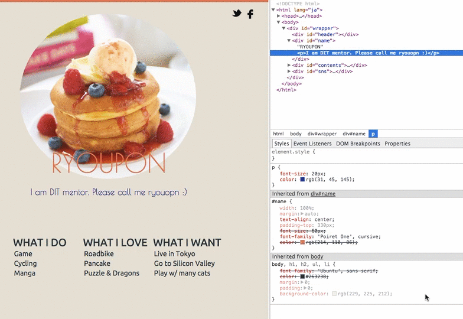
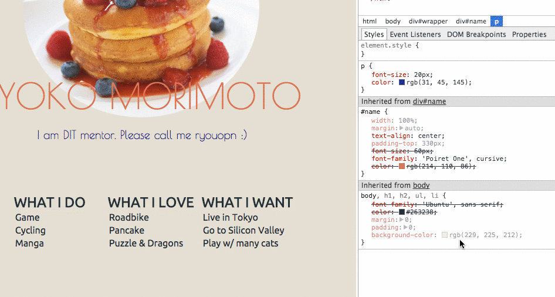
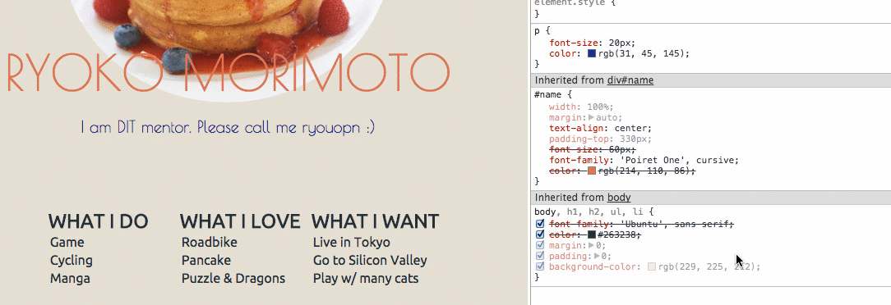
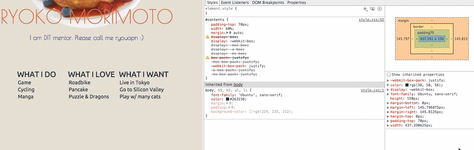
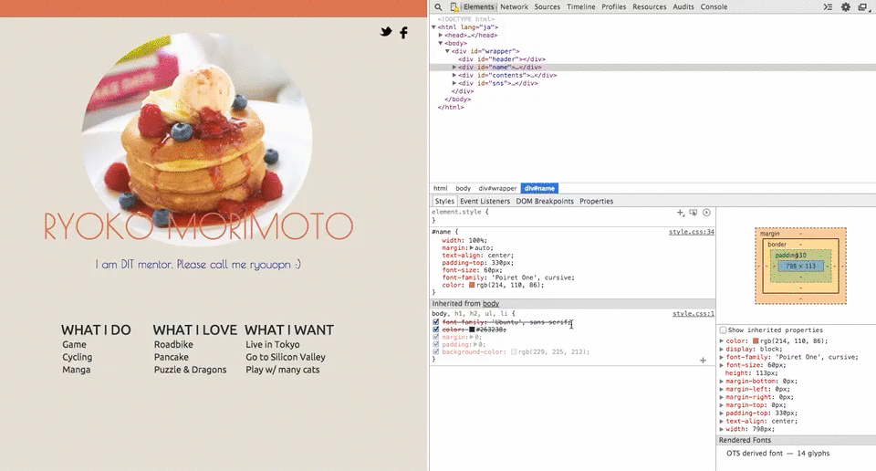
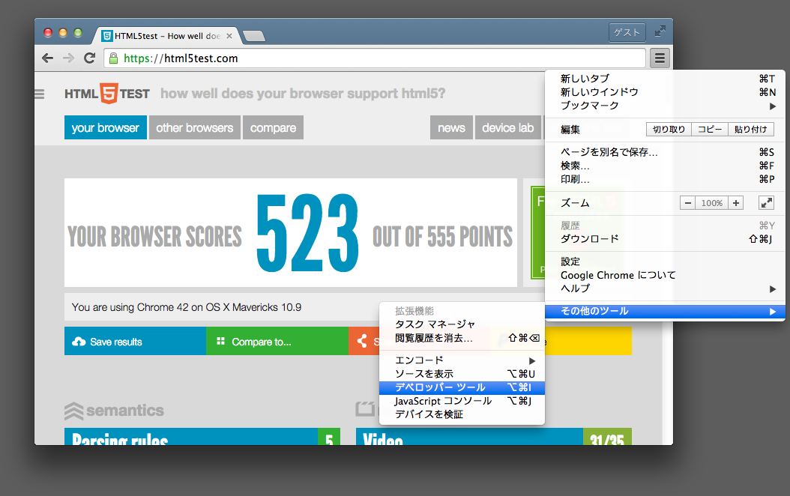
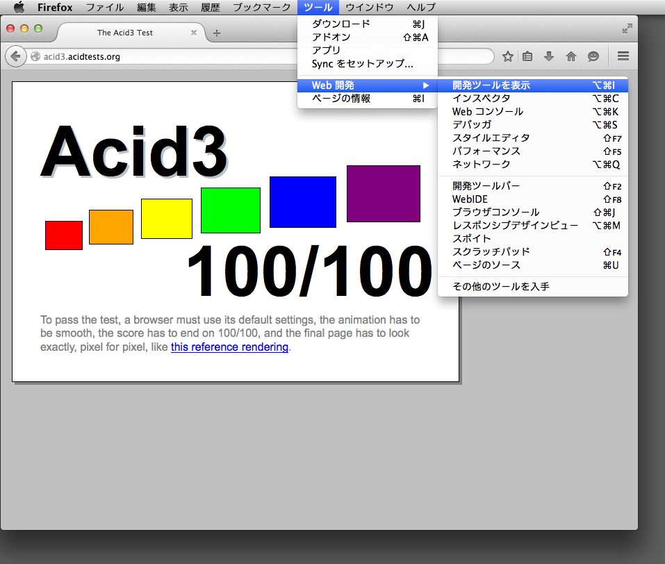
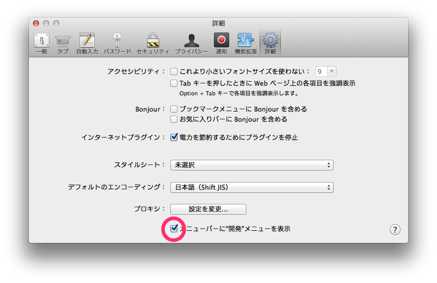
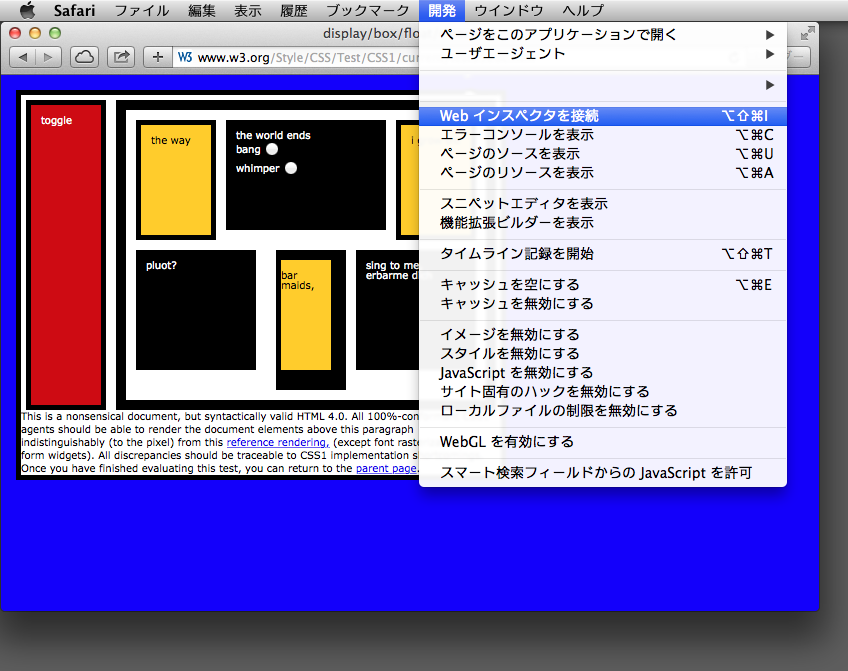

# デベロッパーツール
最近のモダンブラウザにはウェブ開発を支援する機能が実装されています．  
テキストエディタとにらめっこするのもいいのですが，視覚的に編集しててみるのはどうでしょうか．

## 使い道
本稿ではデベロッパーツールの使い道の一部に触れる程度にとどまっています．  
詳しい使い方を知りたい方は，[みんなのGoogle先生](https://www.google.co.jp/search?q=デベロッパーツール)に聞いてみましょう．

### HTML: HTMLをリアルタイムに編集する
HTMLをリアルタイムに編集することが出来ます．

### HTML: ノードツリーからノードを削除する
HTML文書はブラウザの内部においてツリー構造で表現される．．．という話はさておき，編集することが出来れば削除することも出来ます．

### CSS: カラーピッカーを使用して色を変更する
「あの色の名前がわからない」「思っている色と微妙に違う」．．．こんなことでお悩みではありませんか?  
カラーピッカーを使えば問題を解決してくれるでしょう．

### CSS: プロパティの追加と有効化・無効化
HTMLをリアルタイムに編集することが出来るならCSSも編集することが出来ます．  
プロパティを追加したり，有効化・無効化を切り替えたりすることが出来ます．

### CSS: プロパティの削除
「誤ってプロパティを追加してしまった」．．．御安心ください，削除することも出来ます．

### CSS: ボックスモデルの確認
「padding？margin？」「サイズがおかしい」．．．そんな貴方にはボックスモデル．  
要素のサイズやマージン等を視覚的に確認することが出来ます．

### HTML/CSS: 編集結果の保存
もちろん保存することも出来ます．

## Google Chrome
Google Chromeの設定→その他のツール→デベロッパー ツール（⌥⌘i）

## Mozilla Firefox
ツール→Web 開発→開発ツールを表示（⌥⌘i）

## Safari
デフォルトではメニューバーに”開発”メニューが表示されません．  
表示されるように設定を変更しましょう．  
Safari→環境設定（⌘,）→メニューバーに”開発”メニューを表示

開発→Web インスペクタを表示（⌥⌘i）

## Internet Explorer
ツール→F12 開発者ツール