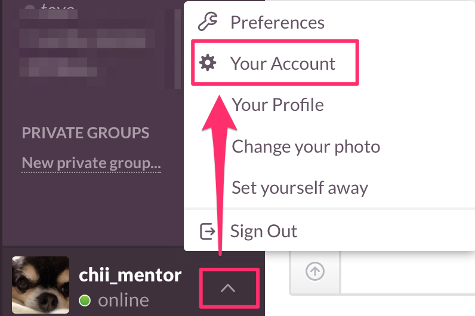

# slackの使い方
DITではslackというコミュニケーションツールを使っています。
## slackとは
slackとは、2013年8月に公開されたと最新のツールで、大企業からベンチャー企業まで、さまざまな企業が導入しています。

## なぜslackなの？
slackは、ファイルをアップロードできることはもちろん、たくさんの外部ツールと連携ができたり、直感的にもわかりやすいツールです。

## 基本的な使い方
slackはwebブラウザ、またはアプリから利用できます。

* [iOS](https://appsto.re/jp/5mE4K.i)
* [android](https://play.google.com/store/apps/details?id=com.Slack&hl=ja)
* [webブラウザ](https://slack.com)

まず始めに、<a href="https://dit-rohm.slack.com/" target="_blank">dit-rohm.slack.com</a>でSign inします。

  Sign inすると、以下のような画面になります。

  * チャンネル一覧からチャンネルを選べます
  * メンバー一覧から個人へDMを送ることができます。

### スマホアプリの場合
  同じように<a href="https://dit-rohm.slack.com/" target="_blank">dit-rohm.slack.com</a>でSign inします。

  メールアドレスとパスワードを入力すると、以下のような画面になります。

  今は**general**チャンネルにいます。

  画面左から右へフリックするとチャンネル一覧やメンバー一覧が見れます。

  移動したいチェンネル名を押して、チャンネル移動をしてください。

## channelについて
DITでは主に以下の4つのchannelがあります。

**general**

"general"チャンネルでは、一般的な事務連絡をします。

**question**

  "question"チャンネルでは、質問を受け付けています。勉強会に関するプログラムに関わらず、プログラム関連のこと全般やパソコンのことなどなんでも！

授業の課題を質問される際は以下の項目も教えてください。

  * 課題内容
  * わからない所
  * 自分なりの考え
  * 写真やスクリーンショット（あれば）

**reference**

"reference"チャンネルでは、勉強会で使用する資料などを配布します。

**random**

"random"チャンネルでは、どうでもいいことを話しましょう！"お腹すいたー"などでも本当になんでも！

## やっておくべき設定
### プロフィール設定

フルネームと画像を設定しましょう。

左下の上矢印マークをクリックし、**Your Account**を選択してください。

すると、webブラウザが開きます。

**Profile**タブを選択し、**First&LastName**を入力してください。

**What I Do**には、所属学部を記入してください。

次に、プロフィール画像を変更します。

**Photo**タブを選択し、**Choose File**で画像を選び**Upload Image**で変更します。

DITはこれからもslackでみんなと連絡をとっていきます。

みさなん、slackに慣れていきましょう！

#### 参考資料
* [チャットツール「Slack」を導入しました！なかなか便利なSlash Commandsについても。](http://maplesystems.co.jp/blog/all/business/10430.html)
* [非エンジニアこそSlackを使うべき！──KAI-YOUでも話題のコミュニケーションツールを導入してみた](http://kai-you.hatenablog.com/entry/2014/08/11/154324)
* [新時代のコミュニケーションツール"Slack"を使ってみよう！](http://matome.naver.jp/odai/2140816727781771801)
* [チャットワークを超えた？イマドキのグループチャットツール【Slack（スラック）】の登録方法と使い方を解説](http://hackhackhack.jp/slack/)
* [Slackを導入してから8ヶ月経ちました](http://tech.sanwasystem.com/entry/2015/03/10/193600)
* [プロジェクト進行チーム内コミュニケーションツール「slack」がすごく便利なのでご紹介](http://wp.yat-net.com/?p=4352)

