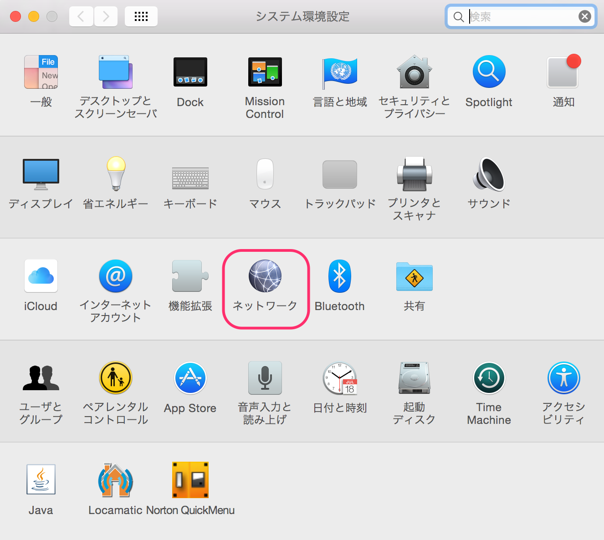
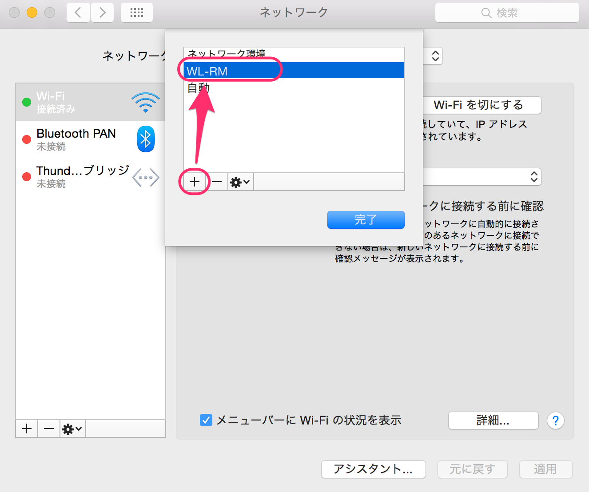
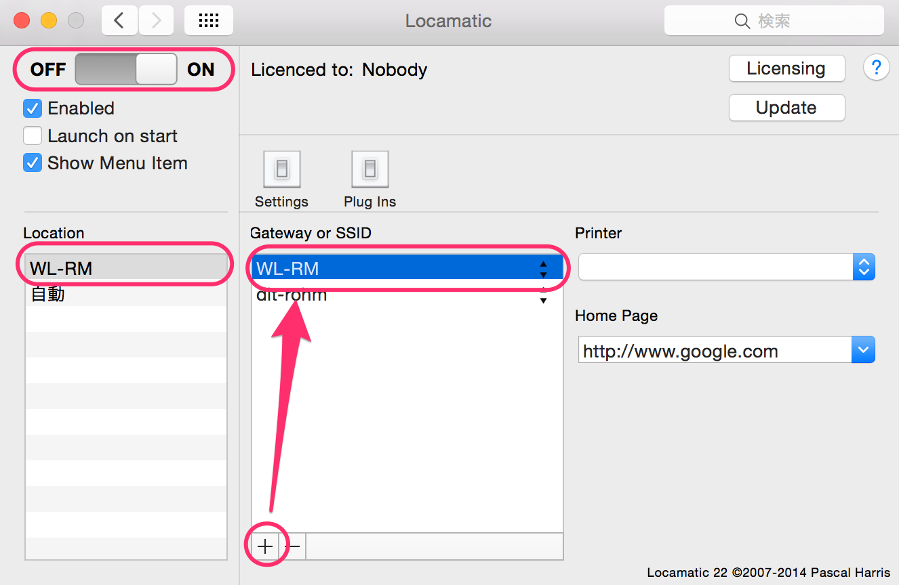

## プロキシ設定（Mac編）

ローム記念館でのプロキシ設定方法の紹介です。
ネットワークは「WL-RM」に接続しておいてください。

1.システム環境設定から「ネットワーク」を選択します。

2.「ネットワーク環境」から「ネットワーク環境を編集」を選択します。「＋」ボタンをクリックし、新たに「WL-RM」(ここは任意の名前でOK)を作ってください。そして完了ボタンをクリック。

3.「ネットワーク環境」を先ほど作成した「WL-RM」に設定し、詳細をクリック。「プロキシ」タブを選択します。

「構成するプロトコルを選択」の「Webプロキシ(HTTP)」と「保護されたWebプロキシ(HTTPS)」と「FTPプロキシ」をチェックし、webプロキシサーバとポート番号をそれぞれ次のように設定します。

> Webプロキシサーバ： proxyr.drm.doshisha.ac.jp

> ポート： 8080

また、「プロキシ設定を使用しないホストとドメイン」欄に以下を追加します。

> do-net.drm.doshisha.ac.jp

> do-netmac.drm.doshisha.ac.jp

設定したら、「ok」>「適用」ボタンをクリックします。
これで設定は終わりです！

（注意）「WL-RM」以外を使うときは、ネットワーク環境を「自動」に切り替えてくださいね！

## おまけ

先ほどまでにMacでのプロキシ設定の方法を説明してきました！しかし、ネットワークの環境をいちいち切り替えるのがとても面倒になってくると思います。

そんなあなたに **Locamatic** をご紹介します！

Locamaticとは、繋がっているネットワークによって、設定を変えてくれるとっても便利なものです。これさえ入れておけばいちいちネットワークを切り替える必要がないのでかなり幸せになれます！

## インストール方法

[locamatic](http://www.45rpmsoftware.com/locamatic.php)にアクセスしてください。
もしくは"locamatic"でggって出てくる「45 RPM Software - Locamatic」をクリック！

そしてDownloadしてください。

そして起動します。

1.設定をONにしましょう。

2.「Location」の部分に、先ほど自分が作成した「WL-RM」が表示されているはずです。「WL-RM」をクリックし、「+」ボタンで「WL-RM」を追加してください。

以上です！これできっと幸せになれるはずです！

