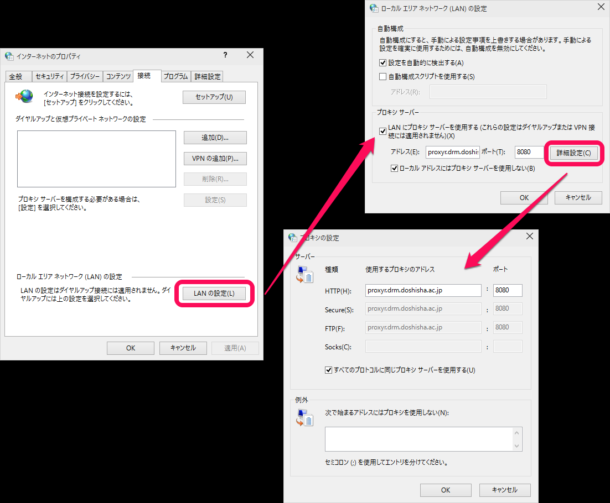
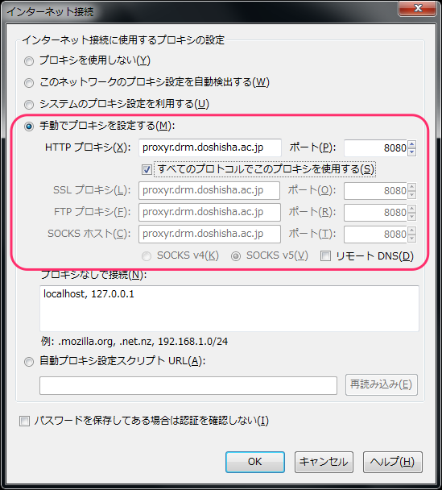

## プロキシ設定（Windows編） 

ローム記念館でのプロキシ設定方法の紹介です。
ネットワークは「WL-RM」に接続しておいてください。

1.「スタート」>「コントロールパネル」>「ネットワークとインターネット」をクリックします。

2.「インターネットのプロパティ」の「接続」タブを選択します。「LANの設定」ボタンをクリックし、チェックボックス「LAN にプロキシ サーバーを使用する」をチェックし、「アドレス」、「ポート」に以下のように入力してください。

> アドレス： proxyr.drm.doshisha.ac.jp

> ポート： 8080

「詳細設定」をクリックします。

「すべてのプロトコルに同じプロキシサーバーを使用する」にチェックが入っているか確認して問題がなければ「OK」をクリックしてウィンドウを閉じてください。

 これで設定は終わりです！

（注意）「WL-RM」以外を使うときは、「LAN にプロキシ サーバーを使用する」のチェックを外してくださいね！

# Firefox

「手動でプロキシを設定する」をチェックし、「プロキシ」と「ポート」を先ほどと同じように以下のように設定します。

> アドレス： proxyr.drm.doshisha.ac.jp

> ポート： 8080

「すべてのプロトコルでこのプロキシを使用する」にチェックをしてください。