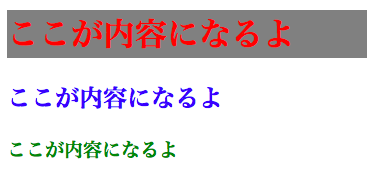
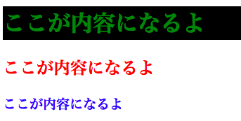

## HTMLを書いてみよう
[同志社大学のWebページ](http://www.doshisha.ac.jp/index.html)を表示してみよう。
ブラウザで右クリックをして [ページのソースを表示] を押そう。
ここで表示されるテキストがHTML（Hypertext Markup Language）と呼ばれるWeb表示に用いられるものだよ。

Sublime Text2を開いてCommand+Nを押そう（Windowsの場合はControl+Nだよ）。
新しいファイルが開いたらCommand+Sを押してファイル名をindex.htmlと書いてデスクトップに保存しよう。
次に以下のHTMLを写してみよう。

###index.html
```html
<!DOCTYPE html>
<html lang="ja">
<head>
  <meta charset="UTF-8">
  <title>ここがタイトルだよ</title>
</head>
<body>
  <h1>ここが内容になるよ</h1>
  <h2>ここが内容になるよ</h2>
  <h3>ここが内容になるよ</h3>
</body>
</html>
```

## 書いたHTMLをブラウザで見てみよう
保存したindex.htmlを開くと書いたHTMLをブラウザで確認できるよ。

###index.html
```html
<title>ここがタイトルだよ</title>
```
titleで指定したものがページのタイトルになっているよ。

```html
<body>
  <h1>ここが内容になるよ</h1>  
</body>
```

bodyで指定したものがページの中身になっているよ。

## HTMLをCSSで装飾してみよう
さっきの殺風景なHTMLに装飾を加えるのがCSS（Cascading Style Sheets）だよ。CSSで文字の色や背景を変えてみよう！

Sublime Text2を開いてCommand+Nを押そう（Windowsの場合はControl+Nだよ）。
ファイルが開いたらstyle.cssと書いてデスクトップに保存しよう。
次に以下のCSSを書き写してみよう。

###style.css
```css
h1 {
  color: red;
  background-color: gray;
}

h2 {
  color: blue;
}

h3 {
  color: green;
}
```

さっき作成したindex.htmlに以下の1行を追記してstyle.cssを読み込もう。

###index.html
```html
---（中略）---
  <title>ここがタイトルだよ</title>
  <link rel="stylesheet" href="style.css">
</head>
---（中略）---
```

## 書いたHTMLとCSSをブラウザで見てみよう
ちゃんと装飾されて表示されたかな？



## 発展課題
htmlのbodyに以下のコードを書き写してブラウザで確認してみよう。

###index.html
```html
---（中略）---
<body>
  <a href="http://www.doshisha.ac.jp/students/index.html">同志社大学</a>
  <p>こんにちはこんにちは！</p>
  <h1>ここが内容になるよ</h1>
---（中略）---
```

cssに以下のコードを書き写してブラウザで確認してみよう。

###style.css
```css
---（中略）---
h1 {
  color: red;
  background-color: gray;
  font-size: 30px;
  border: 3px solid red;
  padding: 16px;
  border-radius: 20px;
  transition: 1s;
}

h1:hover {
  background-color: white;
}
---（中略）---
```

一行ずつ書き写しながらブラウザで動作を確認しよう！
自分で調べるときは「html タグ」や「css プロパティ」で検索するのがオススメだよ！

## 理解度チェック問題
以下の画像のように表示させてみよう！



[次へ](2_profile.md)
