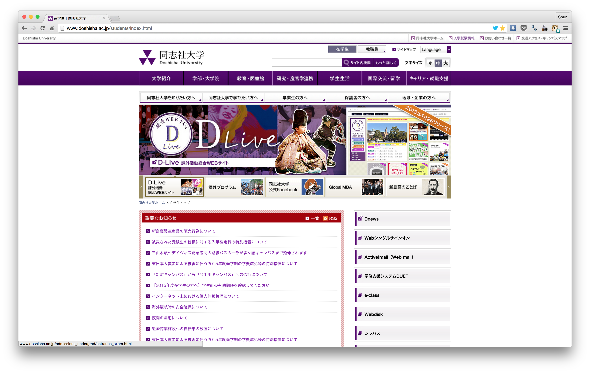
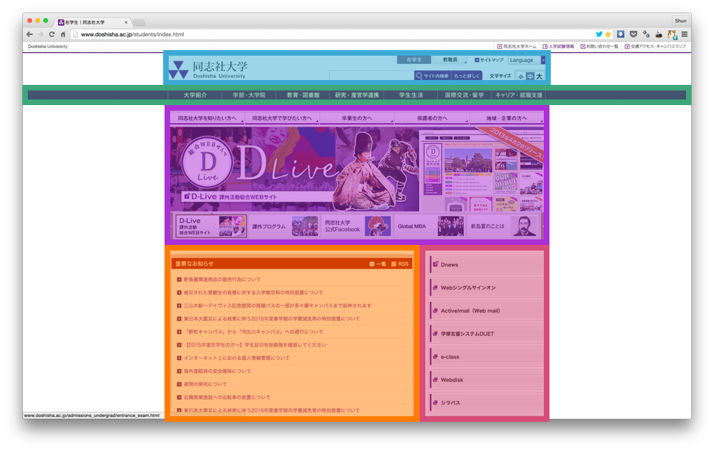

## 実際のウェブページはどのように作られているのか

【[初めてのHTML](helloworld.md)】を通して、Webサイトの文字はどのように書くのか、どのように装飾するのかを学んだと思います。

では、実際にウェブ上で公開されているサイトはどのように作られているのでしょうか。

皆さんにとって最も身近であろう[同志社大学 在学生ページ](http://www.doshisha.ac.jp/students/index.html)を例に見ましょう。

綺麗に整列された以下のようなページを見ていることかと思います。



これに少し手を加えてみましょう。



お分かりいただけるでしょうか？同志社のウェブサイトは、このような【箱】を組み合わせたようにパーツが配置され、構成されています。

この箱は一般的に「ボックス」、また箱を作るタグ\<div\>から「ディブ」と呼ばれたりします。

実は、今どきのウェブサイトは全てこのような箱の組み合わせで構成されています。

昔のウェブサイトは箱でのレイアウトをせず、テキストをそのまま打っているものが多かったです。そちらもシンプルで良いのですが、どうせならいまどきのやり方を覚えましょう。

昔のサイトの参考としてこちらを載せておきます。

 > [ハッカーになろう（How To Become A Hacker）](http://cruel.org/freeware/hacker.html)
 
 プログラミングを学ぶにあたって一読の価値があると思われる、おすすめのサイトです。暇なときにでもぜひ読んでみてください。
 
 
## \<div>タグを使って箱を作る

では話を戻して、\<div>を組み合わせるレイアウトを実践しましょう。

では【[初めてのHTML](helloworld.md)】の時と同じ要領で、HTMLファイルとCSSファイルを用意しましょう。

なお今回は名前を「div.html」、「div.css」とします。

ファイルを用意できたら以下のソースコードを書き写してください。

- `div.html`

```html
<!DOCTYPE html>
  <html lang="ja">
    <head>
      <meta charset="UTF-8">
      <title>div_sample</title>
      <link rel="stylesheet" href="div.css">
    </head>
  <body>
    <div>Division 1</div>
    <div>Division 2</div>
  </body>
</html>
```

- `div.css`

```css
div {
  background-color: red;
  width: 300px;
  height: 300px;
  margin-top: 10px;
}
```

HTMLタグやCSSのプロパティの意味が分からなければ、ぜひリファレンス（[HTML版](../common/html-reference.md), [CSS版](../common/css-reference.md)）を活用してください。もしくはメンターにどんどん質問してください。

上記のコードが打ち込めたら保存し、`div.html`を開いてみてください。

赤い正方形が2つ表示されていますか？

## \<div>を個別に設定する

さっきのコードでは、CSSプロパティを変更すると全ての\<div>要素に同じ値が設定されてしまいます。それでは柔軟なレイアウトはできませんよね？

そこで、\<div>を一つ一つ個別に設定出来るように「id」を付けます。

先ほどの2つのファイルを以下のように編集しましょう。

- `div.html`

```html
<!DOCTYPE html>
  <html lang="ja">
    <head>
      <meta charset="UTF-8">
      <title>div_sample</title>
      <link rel="stylesheet" href="div.css">
    </head>
  <body>
    <div id="one">Division 1</div>
    <div id="two">Division 2</div>
  </body>
</html>
```

- `div.css`

```css
#one {
  background-color: red;
  width: 300px;
  height: 300px;
  margin-top: 10px;
}

#two {
  background-color: blue;
  width: 300px;
  height: 300px;
  margin-top: 10px;
  color: white;
}
```

書き換えることが出来たら`div.html`をウェブブラウザで開いて確認してみてください。

2つ目の\<div>の背景が青に、文字が白になっていますね？

### 発展

少し発展して、\<div>を入れ子構造にしてみましょう。

先ほどの"one"、"two"と付けた\<div>をさらに\<div>で囲います。

この\<div>に好きな"id"を付けて、背景色を変えてみてください。どうなるでしょうか？

- `div.html`

```html
<!DOCTYPE html>
  <html lang="ja">
    <head>
      <meta charset="UTF-8">
      <title>div_sample</title>
      <link rel="stylesheet" href="div.css">
    </head>
  <body>
    <!-- この<div>を編集してみてください -->
    <div>
      <div id="one">Division 1</div>
      <div id="two">Division 2</div>
    </div>
  </body>
</html>
```

## プロフィールページの作成

ここまでの内容が理解できていれば、参考に示したようなプロフィールページは簡単に作ることが出来ます。

テンプレートを用意したので、習ったことを確認しながら編集を行ってください。一部まだ出てきていないタグがありますが、先ほども載せたリファレンス（[HTML版](../common/html-reference.md), [CSS版](../common/css-reference.md)）を見れば大丈夫です。

編集するだけでなくオリジナル要素を加えるのも大歓迎です。自分が表現したいものを作る方法が分からないときはメンターに相談してください。

> [profile-page.zip](./sample/profile-page.zip?raw=true)

背景にはぜひ自分の写真を使用してください。

良い写真が無い場合は周りのメンバーと撮り合ったりしてみましょう！

撮った写真はSlackでメッセージに添付すれば、スマートフォンとPC間で手軽に共有できます。
