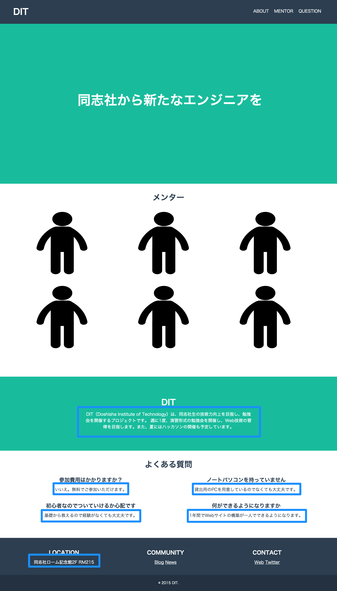

# HTMLとCSSでDITのようなWebサイトを作ってみよう

## 課題

今回は、これまでに勉強したHTML、CSSの知識を使ってDITのようなWebサイトを作成してみましょう。

参考の色と、HTMLの構造のヒントを下に書いています。まずは自分で考えてみて、わからなかったらヒントを見てください。

## ヒント

色の指定はありませんが、もし希望の色がない場合は以下の2色を使ってみてください。

* \#18BC9C（Light Sea Green）
* \#2C3E50（Madison）

HTMLの構造は以下の図のようになっています。

### div
ピンク色の四角で囲まれた部分をdivタグで作ってみましょう。

### h1〜h3 
オレンジ色の四角で囲まれた部分をh1〜h3タグで作ってみましょう。

### p 
青色の四角で囲まれた部分をpタグで作ってみましょう。

### ul, li, a 
黄色の四角で囲まれた部分をリストやaタグで作ってみましょう。

### 要素を横並びにするには
前回の授業で、`float`というものが出てきました。
`float`を使えばできるかも...

<a href="../3/basic_bloglike_layout.md" target="_blank">前回のテキスト</a>を確認してみましょう。

### 解答

今回の課題の解答は、<a href="./html-css-text.md" target="_blank">ここ</a>にあります！困った時や、自分の書いたコードの答え合わせなどに使用してください。
  [次へ HTML, CSSの総まとめ（解答）](./04/html-css-text.md)
  [次へ HTML, CSSの総まとめ（解答）](../04/html-css-text.md)
 
  [次へ HTML, CSSの総まとめ（解答）](../04/html-css-text.md)
 
[前へ HTML, CSSの総まとめ](./html-css.md)
 
[次へ HTML, CSSの総まとめ（解答）](./html-css-text.md)
 
[前へ HTML, CSSの総まとめ](./html-css.md)
 
[次へ HTML, CSSの総まとめ（解答）](./html-css-text.md)
 
[前へ HTML, CSSの総まとめ](./html-css.md)
 
[次へ HTML, CSSの総まとめ（解答）](./html-css-text.md)
 
[前へ HTML, CSSの総まとめ](./html-css.md)
 
[次へ HTML, CSSの総まとめ（解答）](./html-css-text.md)
 
[前へ HTML, CSSの総まとめ](./html-css.md)
 
[次へ HTML, CSSの総まとめ（解答）](./html-css-text.md)
 
[前へ HTML, CSSの総まとめ](./html-css.md)
 
[次へ HTML, CSSの総まとめ（解答）](./html-css-text.md)
