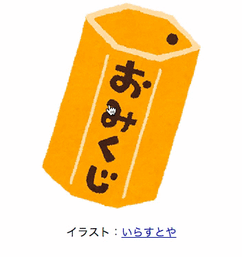

# おみくじ
HTMLとJavaScriptを使って「おみくじ」を作りましょう。
余裕があればテンプレートを書き換えて機能を付け加えたり、デザインを変更してみましょう。

テンプレートのダウンロードは[こちら](template.zip "template.zip")．

### 完成図



1. ページを開くと，みくじ筒の画像(img/omikuji.png)が表示される
1. みくじ筒の画像(img/omikuji.png)をクリックするとみくじの画像(img/omikuji_X.png)に切り替わる

なお，みくじの画像のXには1から6までのランダムな数字が入ります。

### 要求仕様
1. loadイベントが発生した時…
  1. みくじの画像を表示させる``要素を取得
  1. ``要素がクリックされた時…
    1. 1から6までのランダムな数値を生成する
    1. みくじの画像へのパスを生成する
    1. ``要素のsrc属性を書き換える

## 使用する構文や関数
 1. HTML
  1. ``
 1. JavaScript
  1. 文字列の結合
  1. window.onload
  1. document.getElementById(id)
  1. element.setAttribute(name, value)  
     element.addEventListener(type, listener)
  1. Math.floor(number)  
     Math.random()

####index.html
```html
<!DOCTYPE html>
<html lang="en">
<head>
  <meta charset="UTF-8">
  <title>example</title>
</head>
<body>
  
</body>
</html>
```

####omikuji.js
```javascript
window.onload = function() {
  document.getElementById('hoge').addEventListener('click', function() {
    var satellite = 'luna';
    this.setAttribute('src', satellite + '.png');
    this.setAttribute('alt', satellite);
  });
};
```

## 1.文字列の結合
文字列の結合には`+`演算子を用います。文字列と数値を結合する場合、数値が文字列に変換された後に結合されます。複数の数値と文字列を結合する場合、もしくは複数の数値を文字列として結合する場合には注意が必要です。
```javascript
var textA = '吾輩は';
var textB = '猫である';

// 複数の文字列の結合
textA + textB // 吾輩は猫である
textA + 'hogeである' // 吾輩はhogeである
'メロスは' + '村の牧人' + 'である' // メロスは村の牧人である

// 文字列と数値の結合
var numberA = 1234;
var numberB = 3.14;

textA + numberA // 吾輩は1234
textA + numberA + numberB // 吾輩は12343.14

// 注意：式評価の順序によって結果が異なる
textA + (numberA + numberB) // 吾輩は1237.14
numberA + numberB + textA // 1237.14吾輩は

// 例題：12343.14
numberA + numberB                       // X 1237.14  number + number
numberA.toString() + numberB            // O 12343.14 string + number
numberA + numberB.toString()            // O 12343.14 number + string
numberA.toString() + numberB.toString() // O 12343.14 string + string
String(numberA) + numberB               // O 12343.14 string + number
numberA + String(numberB)               // O 12343.14 number + string
String(numberA) + String(numberB)       // O 12343.14 string + string
```

## 2.オブジェクト: window
### プロパティ: onload
onloadにはloadイベントに対応するイベントハンドラーを記述します。
loadイベントはDOMツリーの構築・外部リソースの読み込み（画像, CSS, スクリプト）が終了した時点で発生します。

```javascript
// Method 1
window.onload = function() {
  // do anything
};

// Method 2
function hoge() {
  // do anything
}

window.onload = hoge;

```

## 3.オブジェクト: document
### メソッド: getElementById(id)
該当するIDを持つ要素を返します。

```javascript
element = document.getElementById('hoge');

if (element != null) {
  // elementオブジェクト: 該当するIDを持つ要素が見つかった
} else {
  // null: 該当するIDを持つ要素が見つからなかった
}
```

## 4.オブジェクト: element
### (1)メソッド: setAttribute(name, value)
指定の要素に属性を追加します。属性名が重複している場合は属性値を変更します。

```javascript
element.setAttribute('src','luna.png');
// 

element.setAttribute('alt','luna');
// 
```

### (2)メソッド: addEventListener(type, listener)
指定の要素にイベントリスナーを追加します。

```javascript
// elementがクリックされた時に処理を実行する
element.addEventListener('click', function () {
  /*
    do anything
    this == element
  */
});
```

## 5.オブジェクト: Math
### (1)メソッド: floor(number)
指定された数値の小数点以下を切り捨てた値を返します。

```javascript
Math.floor(35.1); // 35
Math.floor(35.9); // 35
```

### (2)メソッド: random()
0以上1未満の範囲で疑似乱数を返します。

```javascript
Math.random(); // 0.13960939436219633
Math.random(); // 0.49465942149981856
```

## ヒント
### 指定された範囲の乱数を生成
```javascript
function randInt(min, max) {
  return Math.floor(Math.random() * (max - min + 1)) + min;
}

randInt(1, 6); // 6
randInt(1, 6); // 3
randInt(1, 6); // 1
```

[前へ おみくじを作ってみよう](../05/omikuji.md)

[次へ おみくじを作ってみよう（解説）](../05/omikuji_solution.md)
