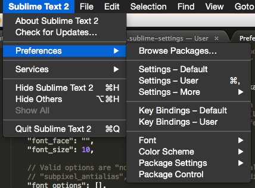
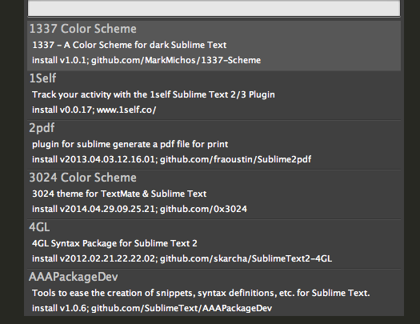
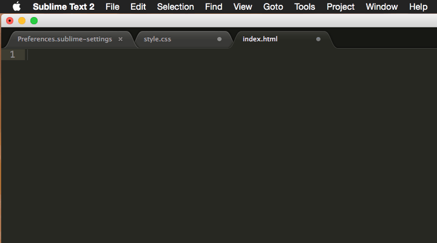

# Sublime Textのカスタマイズ
今日はみんなが使っているSublimeTextエディタのカスタマイズを行います。
HTMLやCSSなどのWebの勉強ではありませんが、エディタを自分好みに設定することは開発する上でとても大事なことです。
自分好みに設定されたエディタを使うことでプログラミングの生産性が数倍変わります。

## 環境設定のカスタマイズ
まずはSublimeTextの環境設定を変更してみましょう。
上のメニューに

- Sublime Text2 > Preferences > Settings - Default
- Sublime Text2 > Preferences > Settings - User

があることを確認してください。



それぞれ「Default」がもとの設定集で、
「User」に自分好みの設定を書くことで「Default」の設定を上書きすることができます。

例えば`"font_size"`を変更してみましょう。
「Default」ファイルで`"font_size"`を設定している場所を確認してみます。


15行目で`"font_size"`が10で設定されていることが分かりました。
これを「User」で以下のように書くことで上書きすることができます。


フォントサイズは大きくなりましたか？

なお、設定を2つ以上変更したい場合は最後の「User」設定以外は「,」が末尾に必要なことに注意してください。

## Package Control
次にPackageControlについて説明します。
PackageControlを用いてパッケージを追加することでSublimeTextにより便利な機能を追加できるようになります。

### Package Controlのインストール
メニューから
- View > Show Console

をクリックしてください。
出てきたコンソールに以下のソースコードをコピーして張りつけましょう。

```
import urllib2,os,hashlib; h = 'eb2297e1a458f27d836c04bb0cbaf282' + 'd0e7a3098092775ccb37ca9d6b2e4b7d'; pf = 'Package Control.sublime-package'; ipp = sublime.installed_packages_path(); os.makedirs( ipp ) if not os.path.exists(ipp) else None; urllib2.install_opener( urllib2.build_opener( urllib2.ProxyHandler()) ); by = urllib2.urlopen( 'http://packagecontrol.io/' + pf.replace(' ', '%20')).read(); dh = hashlib.sha256(by).hexdigest(); open( os.path.join( ipp, pf), 'wb' ).write(by) if dh == h else None; print('Error validating download (got %s instead of %s), please try manual install' % (dh, h) if dh != h else 'Please restart Sublime Text to finish installation')
```

SublimeText3を使っている場合や、上記コードが動かない場合は以下のサイトを参照してください。

> [Installation - Package Control](https://packagecontrol.io/installation#Simple)

インストールが完了したらメニューの
- Tools>Command Palette

をクリックして「package install」と入力しましょう。
以下のような画面になれば成功です。



写真に出ているリストがインストール可能なパッケージの一覧になります。

### オススメパッケージ
#### [Emmet](https://github.com/sergeche/emmet-sublime)
Emmetを導入することで、HTMLやCSSを高速を書けるようになります。以下に使い方の例をあげます。

index.htmlで
- 「!」と記述したあとに「Tab」キーを押してください
- 「h1」と記述したあとに「Tab」キーを押してください

style.cssで
- 「fz」と記述したあとに「Tab」キーを押してください

!の例



もうEmmetの良さが分かったと思います。Emmetを用いることで高速にHTMLやCSSを記述することができます。

細かいショートカットについては公式サイトでショートカットを確認してください。

> [emmet.io](http://docs.emmet.io)

#### [AutoFileName](https://github.com/BoundInCode/AutoFileName)
AutoFileNameは以下の画像のようにファイル名の自動補完を行ってくれます。


これで「ファイル名を間違えて動かない」なんてバグも無くすことができますね。

#### [ColorPicker](https://github.com/weslly/ColorPicker)
ColorPicerは色の設定を視覚的に行いやすくすることができるパッケージです。

例えばCSSの設定中に```#ABC```だと何色かすぐに分からないですよね？


そこで```#ABC```にカーソルを合わせてOSごとに以下のショートカットキーを入力してください。

- Linux: Ctrl+Shift+C
- Windows: Ctrl+Shift+C
- OS X: ⇧⌘C

こんなカラーピッカーは現れましたか？


これで視覚的に色が分かるようになりましたね。
このカラーピッカーから色を選択することも可能です。

## まとめ
上記以外にも便利なパッケージはたくさんあります。
自分でも調べてみてSublimeTextをもっと便利なものにしていきましょう！
 
[前へ Sublime Textのカスタマイズ](./sublime.md)
 
[次へ Bootstrap入門](./bootstrap.md)
 
[前へ Sublime Textのカスタマイズ](./sublime.md)
